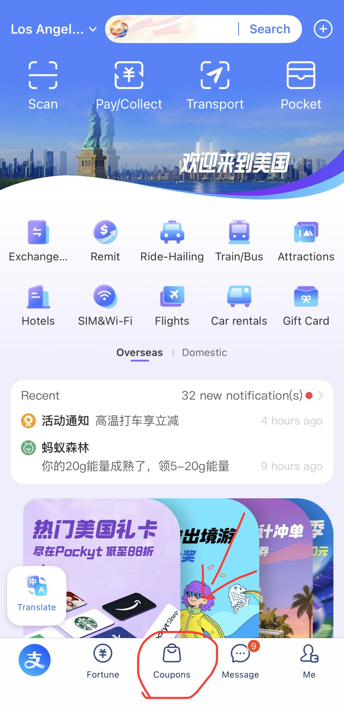
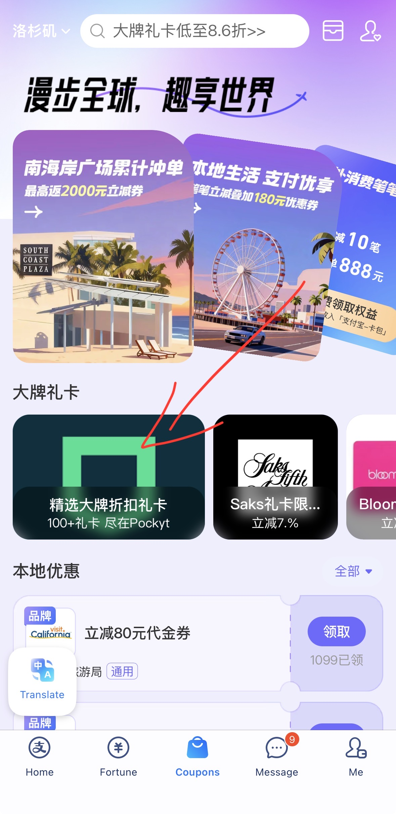
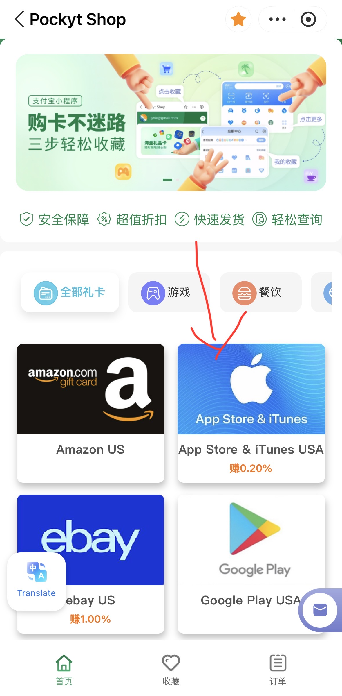
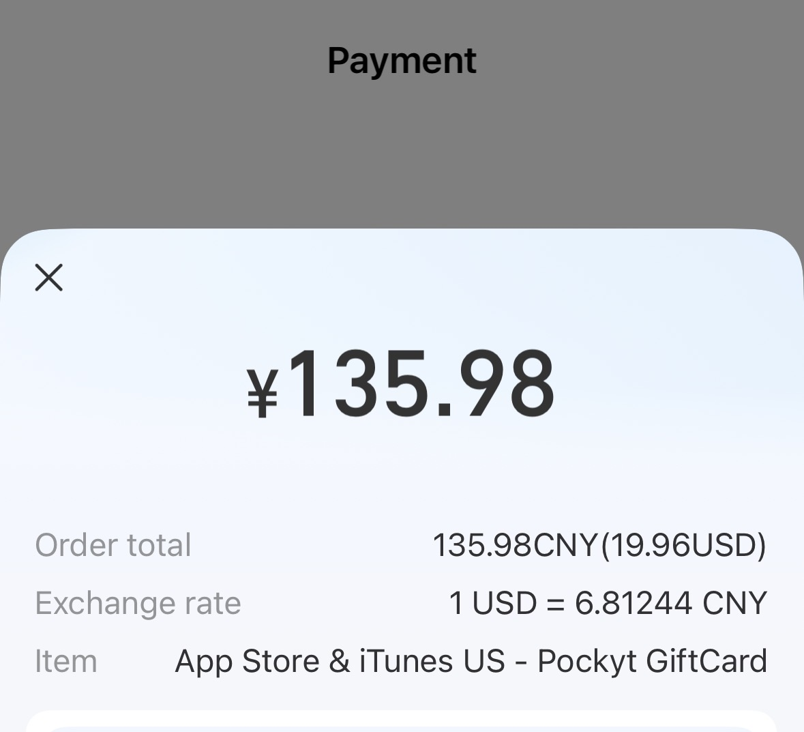

# ChatGPT Plus 国内充值指南（2026 年 7 月更新）

> 最后更新：2026 年 7 月 · 本文长期维护，价格与政策以官网 / 下单页最新显示为准。
> 看到更新时间过久，欢迎提 Issue 催更。

一句话说明这篇文章想干的事：帮你把 ChatGPT Plus 稳稳开起来、少花冤枉钱、别踩坑——哪怕你最后一个第三方服务都不用。

先说清楚： 我们自己也运营一个 ChatGPT / Claude 充值服务 Aonir（见下文「我们的服务」）。但这份指南不是软文，它把每条路的真实成本、操作难度和风险都摊开讲，让你自己选。文中所有关于我们的数字都放在一个独立小节里，绝不混进「客观对比」里假装中立。

## 30 秒结论：按你是谁，直接选

| 你的情况 | 直接选 | 为什么 |
| --- | --- | --- |
| 手里有海外信用卡 / 能刷海外亲友的卡 | 路线 A（官方直付） | 最正规、最便宜，绑自己账号，没有任何中间商 |
| 有 iPhone / iPad，愿意折腾一次美区 Apple ID | 路线 C（美区礼品卡） | 走苹果官方内购，几乎没有支付风控；账单地址设免税州，$19.99 一分不多 |
| 技术型、未来还要订 Netflix / Spotify / Claude 等 | 路线 B（海外虚拟卡） | 一卡多用；但 2026 年国内友好的平台基本团灭，门槛已很高 |
| 怕折腾、想用微信几分钟搞定 | 路线 D（第三方代充） | 对大多数非技术用户是最现实的路；前提是会挑平台（本文教你怎么挑） |
| 预算极紧、且完全不在意隐私 | 不要买共享号 | 这不是一条正经的路，省的钱和风险完全不成比例，理由见文末 |

只想快点开、不想读细节的，直接跳到路线 C 的支付宝实测流程或路线 D。

## 先搞明白：为什么国内充 Plus 这么难

很多人以为是自己操作有问题，其实是支付源头和网络环境两道门槛卡住的，跟你会不会用 ChatGPT 无关。搞懂这三点，后面所有报错你都能自己判断：

- Stripe 按 BIN 段拦截中国大陆发卡行。 OpenAI 的收银台是 Stripe。只要卡号前 6 位（BIN）识别为中国大陆银行发行，无论 Visa 还是 Mastercard、无论额度多高、无论 IP 在哪、账单地址填哪，成功率都极低——招行全币种、中信 Visa/JCB 这类双币卡基本都过不了。这一步没有稳定的绕过办法，别再拿国内卡硬试了。
- 地区限制。 OpenAI 只在部分国家/地区开放订阅，中国大陆、香港等地不支持。你的网络出口要落在美国 / 英国 / 新加坡 / 日本 / 加拿大等支持地区。这里有个常被说死的误区：住宅 IP（Residential）更稳，但不是绝对必须——干净、稳定、没被大量滥用过的机房 IP 也能付成功。 真正会翻车的是那种「万人骑」的免费节点和已经被风控盯上的 IP，而不是「只要是机房 IP 就一定不行」。
- 3D Secure 二次验证。 海外信用卡走 3DS 时会给发卡行发短信验证码，国内卡基本没接入海外 3DS 体系，收不到码，自然过不了——这是国内卡在 OpenAI 支付时几乎必然失败的又一个底层原因。

**结论：** 想开 Plus，要么有一张能过 Stripe 风控的海外支付方式，要么把这一步交给别人处理。下面四条路，就是围绕这两种思路展开的。

## 2026 年 ChatGPT 套餐与真实价格

先把「你到底该买哪档」搞清楚，别为用不上的档位多花钱。以下是官网口径（美元、按月），人民币按当时汇率浮动：

| 套餐 | 官方价 | 适合谁 | 关键点 |
| --- | --- | --- | --- |
| Free | $0 | 轻度、偶尔问问题 | 能用最新一代基础模型，但有额度墙；部分地区带广告 |
| Go | $8 / 月 | 预算敏感、量不大 | 注意：Go 在部分地区仍带广告，且不含旗舰模型，性价比不如直接上 Plus |
| Plus | $20 / 月 | 绝大多数人 | 自 2023 年至今没涨过价；含旗舰模型、Deep Research、Codex、Agent 等完整功能 |
| Pro | $100 / 月 | 重度个人用户 | 2026 年新拆出来的中间档，Plus 额度不够、又不想上 $200 时选（约 5× Plus 额度） |
| Pro | $200 / 月 | 极重度 / 专业 | 最高额度（约 20× Plus）、Operator 智能体、高级语音等；用不满就是浪费 |
| Business | $25 / 席·月（年付 $20 / 席，最少 2 席） | 团队 | 数据默认不用于训练；一个人别买，Plus 就够 |

几个容易被忽略的点：

- iOS 内购的 Plus 是 $19.99/月（网页端官网是 $20/月）。苹果按 Apple ID 的账单地址所在州收销售税——账单地址设在没有州销售税的州（俄勒冈、特拉华、蒙大拿、新罕布什尔、阿拉斯加），数字商品免税，到手就是 $19.99，并不比网页端贵。买礼品卡时直接买 $20 面额（实测 $20 卡 ≈ ¥136），别卡着 $19.99 买——留一点余额富余，免得税费或零头差几分钱付不进去。 注意订阅只能在 Apple ID 里管理，网页端管不了。
- GPT-5.6（Sol / Terra / Luna）已于 2026 年 7 月 9 日上线 ChatGPT，Plus 可用 GPT-5.6 Sol；日常默认仍是更快的 GPT-5.5 Instant。也就是说，$20 的 Plus 现在能摸到最新旗舰模型，这一档的性价比是这几年最高的。
- 90% 的个人用户，Plus 就是终点。 判断要不要上 Pro 很简单：正常用一周，数一数「你已达到使用上限」弹了几次。一次都没有，就别升。

## 四条路，逐条讲真实成本与风险

### 路线 A：官方直付（有海外卡就选它，最省钱最正规）

**适合谁：** 手里有一张能过 Stripe 的海外信用卡（或能刷海外亲友的卡、绑了海外卡的 PayPal）的人。

**怎么做：** 挂一个稳定干净的美区节点 → chatgpt.com → Settings → Upgrade → 填卡号、有效期、CVV、美国账单地址 → 提交。$20/月 + 当地税。

**真实成本：** 官方原价，没有任何溢价。

**优点：** 最正规，订阅绑在你自己账号上，没有中间商，自动续费、稳定。

**缺点 / 注意：** 前提是「你真有一张能用的海外卡」——绝大多数国内用户卡在这一步，所以才有后面三条路。别用国内双币卡硬试超过一两次，失败多了会给账号累加风控标签。

**变体：** 海外亲友代付。 如果家人朋友在国外，可以让他们用自己的卡登录你的账号帮你订阅一次，之后每月自动扣他们的卡，你再按月把钱转给他们。零溢价、最省钱，缺点是对方换卡/销卡时你的订阅会断，得记得结清。适合有稳定海外关系的人，但别把「找陌生代付中介」当成这一类——那本质上是路线 D，还没有售后。

### 路线 B：海外虚拟信用卡（技术党可玩，但 2026 年基本团灭）

**适合谁：** 不怵技术、愿意自己一步步搞、未来还想订别的海外服务的人。

**核心原理：** 在海外发卡平台开一张虚拟 Visa/Mastercard，充值美元，再挂美区节点到官网绑卡支付，相当于把自己变成一个「海外用户」。

2026 年的现实——这条路已经很难走了：

- 前两年国内用户量最大的几家平台接连停运：野卡 WildCard、Depay / Dupay（2025 年底正式关服关服务器）、BinGoCard、OneKey 等陆续退场，支持人民币直充的虚拟卡基本绝迹。老用户余额能不能全额提出，全看平台良心。
- 还在运营的，几乎清一色是只支持 USDT 充值的加密 U 卡：要先买币、要过 KYC、开卡费 + 月费 + 手续费叠起来一年多花不少，对普通人门槛很高。
- 平台跑路是真实发生过的风险，这类服务处在跨境支付监管的灰色地带，随时可能消失。

**给还想走这条路的人一条实操建议：** 无论用哪家，别一次性充太多钱进去，单次充够开一次订阅（$25–30）就行，别把大额资金锁在平台里。

**优点：** 一卡多用（Netflix / Spotify / Claude 等都能绑）；账号完全自主。

**缺点 / 注意：** 门槛高、只收 USDT 的居多；各种费用叠起来比 $20 贵不少；对隐私敏感的人不友好；平台跑路风险始终悬着。

### 路线 C：美区 Apple ID + 礼品卡（有苹果设备的人，最「官方」的一条路）

**适合谁：** 有 iPhone 或 iPad、愿意折腾一次美区 Apple ID 的人。（订阅本身绑在你的 OpenAI 账号上，开通后网页端、Mac、安卓都能正常用，只是「买卡 + 下单」这步需要用一台苹果设备完成。）

**为什么它其实很稳：** 付款发生在苹果体系内，OpenAI 看到的只是一笔正常的 App Store 订阅，不碰 Stripe 那套支付风控。这是它相对其他方案最大的优势。而且前面算过，账单地址设在免税州，到手就是 $19.99。

**大致流程：** 切美区 Apple ID → 买美区礼品卡充进余额 → iOS 版 ChatGPT App 内用 Apple 内购订阅 Plus。切区是一次性操作，但 Apple 有个前置要求：切之前得先把这个 Apple ID 上的余额花到 0、并取消现有订阅（订阅要等本期结束）。所以如果这个号上还有没用完的余额或在用的订阅，动手前先处理好。

买礼品卡的来源是最关键的一步，直接决定你会不会被封号：

- **推荐：** 支付宝里的官方合作渠道（Pockyt）。 来源正规、汇率透明，基本不会买到黑卡。下面是我实测的完整流程和截图。
- **不推荐：** 淘宝/闲鱼的低价卡密。折扣越狠越可疑，黑卡（盗刷/被举报来源）一旦被 Apple 风控识别，整个 Apple ID 可能余额清零、订阅取消，严重的连 iCloud 一起冻结。别拿主力号赌这个。

### 支付宝买美区礼品卡：实测流程（附截图）

整个过程在支付宝里就能走完，人民币付款，汇率很实在——我实测买一张 $20 的 App Store 礼品卡，到手价 ¥135.98（当时汇率 1 USD ≈ 6.81 CNY），基本没有溢价。

<table>
  <tr>
    <td width="50%" valign="top" align="center">
       
      <b>①</b> 支付宝<b>左上角</b>把定位切到<b>美国任意城市</b>，页面变成「欢迎来到美国」后，点最下方的 <b>Coupons</b>
    </td>
    <td width="50%" valign="top" align="center">
       
      <b>②</b> 在「大牌礼卡」里点 <b>精选大牌折扣礼卡</b>（尽在 Pockyt）
    </td>
  </tr>
  <tr>
    <td width="50%" valign="top" align="center">
       
      <b>③</b> 进入 Pockyt Shop，选 <b>App Store &amp; iTunes USA</b>，填邮箱、选面额（<b>直接选 $20，别卡着 $19.99</b>）
    </td>
    <td width="50%" valign="top" align="center">
       
      <b>④</b> 支付宝付款：<b>$20 礼品卡实付 ¥135.98</b>，汇率透明、没有高溢价
    </td>
  </tr>
</table>

**拿到卡密后：** App Store → 头像 → Redeem Gift Card or Code 兑换到美区 Apple ID → iOS 版 ChatGPT App 内登录 → Upgrade → 支付方式选 Apple ID Balance → 完成。

**小提示：** 新切区的 Apple ID 有时要先在 App Store 有过一次真实活动（下载个免费 App 或兑换一张小额礼品卡）才算「激活」，激活后再去订阅更顺。

**优点：** 走苹果官方内购，安全性高；免税州账单地址下 $19.99 到手；流程在苹果生态内闭环。

**缺点 / 注意：** 买卡、下单这步需要一台苹果设备；切区前要先清空该 Apple ID 的余额和订阅；礼品卡来源一定要正规；续费、取消都在 Apple ID 订阅管理里操作，不在 OpenAI。

### 路线 D：第三方代充（多数人最省心，但要会挑）

**适合谁：** 怕折腾、不想搞虚拟卡、也没有苹果设备或不想切区、就想用人民币几分钟搞定的人。

**核心原理：** 你用人民币付给代充平台，平台用它自己的海外支付通道 + 干净网络环境，帮你在 OpenAI 官方完成 Plus 订阅。靠谱的平台是自助的——你全程不用交出 ChatGPT 账号密码，拿到的是绑在你自己账号上的真·官方 Plus。

**为什么这两年最流行：** 操作简单（付一下钱）、几分钟到账、全平台通用、走官方支付通道，单纯因为「代付这个动作」被封的概率很低。

但这条路的核心风险在「平台本身」，所以选平台比什么都重要，下一节专门讲。先把优缺点说清楚：

**优点：** 人民币直接付，不用碰虚拟卡和节点；靠谱平台几分钟到账；开通后全平台通用。

**缺点 / 注意：** 

- 依赖第三方——必须找运营稳定、有真实售后承诺的平台，别图便宜碰野鸡小作坊。
- 价格随汇率有微调，但比自己折腾虚拟卡 + 海外卡门槛，整体更现实。
- **隐私红线：** 靠谱的自助平台绝不需要你的 ChatGPT 账号密码。 任何让你交账号密码的个人代充、小代充，一律别碰。

### ⚠️ 单独拎出来说：共享号 / 合租，不是一条正经的路

几十块买一个多人共用的 Plus 账号，听着便宜，但代价极大，我们明确不推荐：

- 零隐私——你和陌生人共用一个号，你聊的所有内容对方都看得到，贴文档、贴代码 = 裸奔。
- 多人异地登录是 OpenAI 封号的头号触发器，账号随时挂。
- 一人违规，全员遭殃；卖家改密码跑路、店铺一夜消失都很常见，没有任何售后。

真想先体验一下 Plus，花几十块买个正规平台的月卡，比这个靠谱得多。

## 一张表看懂几种方式

| 方式 | 操作难度 | 到账速度 | 隐私 | 稳定性 | 真实成本 | 综合 |
| --- | --- | --- | --- | --- | --- | --- |
| A 官方直付 | 低（前提是有海外卡） | 即时 | 高，绑自己账号 | 高，官方自动续费 | $20/月原价 | 有海外卡首选 |
| B 海外虚拟卡 | 高：多为 USDT + KYC | 不稳定，失败要反复排查 | 中，身份信息给发卡平台 | 中，平台停运/跑路风险 | $20 + 各种费用 | 技术党可玩，普通人不推荐 |
| C 美区礼品卡 | 中：切区一次 + 买卡 | 顺利时较快 | 中，走苹果内购 | 中高，苹果体系内很稳 | ≈ ¥136/月起（免税州） | 有苹果设备可选 |
| D 第三方代充 | 低：人民币付款 | 快，靠谱平台几分钟 | 高（前提：自助、不要密码） | 高（前提：平台靠谱） | 随平台/汇率 | 多数非技术用户最现实 |
| 共享号 | 低 | 快但随时失效 | 低，聊天记录暴露 | 低，随时封号 | 最便宜 | 不推荐 |

## 一个关键概念：掉订阅 ≠ 封号

这两件事经常被混为一谈，搞清楚能省你一堆焦虑：

- **掉订阅：** OpenAI 风控判定某笔付款异常后，撤销了这笔订阅。对 ChatGPT 来说通常只是 Plus 权益消失，账号本身一般不受影响，重新开一次就好。这跟「封号」是两回事。
- **封号（account deactivated）：** 账号被停用，聊天记录、自定义 GPT、记忆数据全部清零，申诉成功率很低。

真正导致封号的，几乎都是下面这几件事，而不是「代付」本身：

- 用了黑卡（盗刷信用卡）——个人小代充为了压价常干这个。
- 多人合租 / 共享账号——多地登录触发风控。
- 违规使用内容——踩了 OpenAI 使用政策的红线。
- 把账号密码交给不靠谱的人工代充。

只要你走正规渠道、绑自己账号、别贪便宜，封号概率其实很低，最坏情况通常是掉订阅。

## 怎么挑一个不会跑路的代充平台（5 条硬指标）

这一节不管你用不用我们的服务都值得看——它能帮你筛掉一大半草台班子：

- 看运营年限和真实口碑。 优先选成立时间长、社区里有真实评价的。今天开明天关的店，出问题找不到人。
- 看支付方式。 支持微信 / 支付宝这类可追溯渠道的优先；只收 USDT、或让你付到个人收款码的，格外小心——出了事你连凭据都没有。
- 看是不是自助、要不要密码。 自助下单、全程不要你 ChatGPT 密码才是及格线。凡是要求你改密码交号、或对流程含糊其辞的，直接排除。
- 看有没有可查的订单体系。 有订单号、能查进度的，出问题时才有据可依。
- 看售后条款写没写死。 把「什么情况退、什么情况补、什么情况不管」白纸黑字写清楚的，才算专业——比一句空泛的「包售后」实在得多。

一句话：正规平台帮你扫清的只是「支付」这一环；把「支付」交出去可以，但别把「账号」也交出去。

## 我们的服务：AONIR

- **平台 / 官网：** aonir.com
- **支付方式：** 微信支付，人民币结算
- **充值模式：** ChatGPT Plus、Claude Pro 支持自助下单 + 系统自动处理，不需要提供账号密码；ChatGPT Pro 需联系客服安排
- **覆盖：** 会员权益充值到你本人的官方账号，可在账号支持的安卓、iOS、网页及桌面端使用，具体以对应平台规则为准
- **入口：** 官网直接展示套餐和价格，ChatGPT Plus 可自助下单，无需先加微信询价。

为什么会有人在能自己买礼品卡的情况下还选代充？ 说白了是拿一点点差价换「零折腾」：不用苹果设备、不用切区、微信付一下就行，还能顺带解决 Claude Pro / ChatGPT Pro。图便宜、又愿意动手的，完全可以走上面的礼品卡路线，我们不介意你比。

## 充完之后：账号是你自己的，记住这几条

代充只解决了「支付」这一环。会员到手后，账号能不能长期稳定，取决于你怎么用：

- 网络环境别太乱。 用相对固定、干净的节点就行，别用免费的「万人骑」IP，也别一天到晚在不同国家之间来回切——频繁跨国跳转是 OpenAI 最容易盯上的异常行为之一。
- 账号只握在自己手里。 优先走自助渠道，别到处交账号密码；万一遇到必须人工操作的场景，事后第一时间改密码、检查登录设备。
- 开通后花十秒确认真到账了。 进 Settings → 看到订阅状态是 Plus、模型列表里能选到新模型，就算成了；一时没显示，先完全退出重新登录或换无痕，再对一下你充的是哪个邮箱（多账号的人很容易付错号）。

## 常见问题 FAQ

### Q：微信 / 支付宝能直接付给 OpenAI 吗？

不能。OpenAI 官方只收国际信用卡，以及 Apple / Google 的应用内购买。所有「微信直充 ChatGPT」本质上都是第三方在中间转了一道。

### Q：用国内信用卡到底能不能成功？

成功率极低。Stripe 会按 BIN 段拦截中国大陆发卡行，招行全币、中信 Visa/JCB 基本都不行。失败不扣款，但别把它当稳定方案，更别反复试。

### Q：通过代充开 Plus 会被封号吗？

充到本人账号、走正规渠道的情况下，极少因此封号，最坏是掉订阅（见上文「掉订阅 ≠ 封号」）。真正导致封号的是黑卡、合租、违规内容。

### Q：代充要我账号密码，安全吗？

正规的自助平台不需要你的密码。凡是张口就要账号密码的个人代充，一律别用。

### Q：想省钱，淘宝/闲鱼上几十块的个人代充或共享号能不能碰？

不建议，而且省下的这点钱通常不值得。个人卖家为了把价格压到最低，用的往往是黑卡或即将作废的卡段，OpenAI 风控一旦识别，轻则掉订阅、重则永久封号，你的聊天记录一起没；共享号则是多人同登、隐私全无。更现实的是这类小店流动性极大，真出了问题，人可能已经找不到了。

### Q：Plus 和 Pro 怎么选？

绝大多数人 Plus（$20）够用。正常用一周，数「达到上限」弹了几次，一次都没有就别升。真的天天顶格跑 Deep Research / Codex 再考虑 Pro（$100 约 5×，$200 约 20×）。想细看区别可以参考这篇 ChatGPT Free、Plus 与 Pro 怎么选。

### Q：充值失败了怎么办？

先别慌，多半是官网当时拥堵或网络节点不稳。拿订单号找平台客服重试就行；正规平台会换通道或换 IP 帮你重试，实在交付不了的会按条款退款。

### Q：到期了怎么处理？

看你在哪开的：官网订的在 ChatGPT Settings 里管理，iOS 订的在 Apple ID 订阅里管理；代充多是单月买断、不自动续费，想继续用再下一单即可。

## 附录：卡在哪一步，就看哪一段（自助排查）

国内自己开 Plus，几乎所有人都会卡在下面三个阶段之一。先判断你卡在第几步，再对号入座，比盲目重试有用得多——而且重试越多，越容易给账号累加风控分。

### 阶段一：还没到支付页，就打不开 / 转圈

- **点了「Upgrade」没反应、Stripe 弹窗一直加载：** 多半是节点带宽小、丢包高，Stripe 的脚本没加载全，或浏览器缓存了上次的失败状态。换一个稳定的美区节点、开无痕、清一下缓存重试。
- **提示 Country not supported：** 你的网络出口落在了不支持的地区。把出口切到美 / 英 / 新 / 日 / 加等支持地区，并且别频繁在不同国家之间跳。
- **判断要点：** 这一阶段的问题基本都是网络问题，跟你的卡没关系，别急着换卡。

### 阶段二：进了支付页，但付不进去

- **Your card was declined：** 十有八九用了国内发行的卡，Stripe 按 BIN 段直接拒。国内卡这条没有稳定解法，换支付方式（礼品卡 / 代充）才是正路。
- **We were unable to authenticate your payment method（3DS 验证失败）：** 需要发卡行下发短信验证码，国内卡多半没接入海外 3DS 体系，收不到码，这关过不了。
- **Something went wrong, please try again later：** 常见于同一 IP 短时间内多次尝试、或卡段已被标记。别硬刚，换个思路（礼品卡 / 靠谱代充）比在这里死磕划算。

### 阶段三：付款过了，但会员没到 / 账号异常

- **扣款成功却没有 Plus 标识：** 先完全退出重新登录或换无痕；再确认你充的是哪个邮箱（多账号很容易付错号）；还没有就去邮箱搜 OpenAI 的收据邮件，确认到底扣款没有。
- **礼品卡兑换提示 This code has already been redeemed：** 你大概率买到黑卡了。低价卡密最容易踩这个，认准支付宝官方渠道能基本避免。
- **Your account has been deactivated：** 分两种——充值前就被封的，多是网络/滥用/违规内容触发，可发邮件申诉但成功率不高；充值后被封的，大概率跟黑卡、人工代充交号、或多人共享有关。这也是本文反复强调「别贪便宜」的原因。

## 一句话总结

国内自己给 ChatGPT Plus 充值，本质是在跟 OpenAI 的风控硬刚——支付源头 + 网络环境两道门槛，硬刚多次的代价可能是掉订阅甚至封号。更现实的做法：有海外卡走官方、有苹果设备走美区礼品卡、其余大多数人找一个靠谱的自助平台把「支付」这一环交出去，自己只管用。

不管选哪条路，一个稳定、干净、能访问 ChatGPT 官网的网络环境都是前提，没这个一切白搭。

**免责声明：** 本文仅供信息参考。OpenAI 政策与各平台价格可能随时变化，请以官网 / 下单页最新信息为准。请遵守相关法律法规及各平台使用条款，所有操作与后果由用户自行承担。
