# ChatGPT Plus 国内充值指南（2026）：支付宝买美区 Apple 礼品卡实测

> 最后更新：2026 年 11 月 6 日（北京时间）· Pockyt Shop 的美区 Apple 礼品卡 11 月 6 日中午已补货，客服回信说可以正常下单，我们也打开核实过（[现在还能买吗](#pockyt-status)）。缺货期间我们 11 月 6 日凌晨实测了备用渠道 SEAGM：支付宝付款，$20 卡实付 ¥138.13，约 3 分钟拿到兑换码，Pockyt 再缺货时见 [Pockyt Shop 缺货怎么办](#seagm)。以前的更新见 [Releases](https://github.com/Avarce/chatgpt-plus-china-guide/releases) 和[提交记录](https://github.com/Avarce/chatgpt-plus-china-guide/commits/main/README.md)。
> 看到更新时间过久，欢迎提 Issue 催更。想在价格或入口变化时收到通知，点右上角 Watch → Custom → Releases。

如果你有 iPhone 或 iPad，我在 2026 年 7 月亲测下来最顺手的自助路线是：在支付宝购买一张 $20 美区 Apple 礼品卡（当时实付 ¥135.98，10 月 13 日复测 ¥134.44），充值到美区 Apple ID，再在 iOS 版 ChatGPT App 内完成 Plus 订阅。下面附有支付宝 6 步和 SEAGM 19 步的本人操作截图，同时也会把海外卡、虚拟卡和第三方充值的成本与风险讲清楚。

> **先分清两种礼品卡：** 本文实测的是 **Apple Gift Card → Apple 账户余额 → ChatGPT iOS 订阅**。OpenAI Gift Card 则兑换到 **ChatGPT Wallet**，用于符合条件的网页结账。购买和兑换条件见 [OpenAI 官方说明](https://help.openai.com/en/articles/20001491-buying-and-redeeming-openai-gift-cards)；零售渠道与购买链接见 [OpenAI Gift Card 购买与兑换指南](https://github.com/Avarce/openai-gift-card-guide)。

[直接查看支付宝买美区 Apple 礼品卡的 6 步实测流程](#支付宝买美区礼品卡实测流程附截图)。Pockyt Shop 缺货买不到的话，可以看看 [11 月 6 日实测的备用渠道 SEAGM](#seagm)。

本文由 **AONIR** 维护，我们同时提供 ChatGPT 会员充值服务。下面保留自助操作与服务方案，按你的设备和付款条件选择即可。

> **想用微信充值到自己的 ChatGPT 账号？下面三档都能自助下单，充到本人账号，不用登录密码。**
>
> **ChatGPT Plus：¥168 / 月**，日常工作、学习与个人编程。
>
> **ChatGPT Pro 100：¥730 / 月**，Work / Codex 用量约为 Plus 的 10 倍（10 月 29 日起翻倍），Plus 不够用时再选。
>
> **ChatGPT Pro 200：¥1400 / 月**，约为 Plus 的 20 倍，适合 Pro 100 也常用完的重度用户。
>
> **[Plus 充值 →](https://aonir.com/chatgpt-plus/?utm_source=github&utm_medium=referral&utm_campaign=plus_guide&utm_content=top_warranty_cta)** · **[Pro 100 充值 →](https://aonir.com/chatgpt-pro/?utm_source=github&utm_medium=referral&utm_campaign=plus_guide&utm_content=top_pro_5x_cta)** · **[Pro 200 充值 →](https://aonir.com/chatgpt-pro-200/?utm_source=github&utm_medium=referral&utm_campaign=plus_guide&utm_content=top_pro_10x_cta)** · **[Pro 500 开通 →](https://aonir.com/chatgpt-pro-500/?utm_source=github&utm_medium=referral&utm_campaign=plus_guide&utm_content=top_pro_500_cta)** · [先比较各类充值方式](https://aonir.com/guides/chatgpt-plus-without-foreign-card/?utm_source=github&utm_medium=referral&utm_campaign=plus_guide&utm_content=top_compare)

## 目录

- [30 秒结论：按你是谁，直接选](#30-秒结论按你是谁直接选)
- [为什么国内充 Plus 这么难](#先搞明白为什么国内充-plus-这么难)
- [2026 年 ChatGPT 套餐与真实价格](#2026-年-chatgpt-套餐与真实价格)
- [四条路线的成本与风险](#四条路逐条讲真实成本与风险)
  - [路线 A：官方直付](#路线-a官方直付有海外卡就选它最省钱最正规)
  - [路线 B：海外虚拟信用卡](#路线-b海外虚拟信用卡技术党可玩但-2026-年基本团灭)
  - [路线 C：支付宝买美区 Apple 礼品卡](#路线-c支付宝买美区-apple-礼品卡用-iphone-订阅-chatgpt-plus亲测)
    - [支付宝买卡：6 步实测流程](#支付宝买美区礼品卡实测流程附截图)
    - [Pockyt Shop 现在还能买吗](#pockyt-status) · [缺货怎么办：SEAGM 实测](#seagm)
    - [还没有美区 Apple ID：新注册或改区，付款方式选 None](#apple-id-none)
    - [拿到兑换码后：兑换，再订阅](#apple-redeem-subscribe)
    - [提示「必须提供付款信息才能继续购买」：账单地址改 Oregon](#apple-payment-info-required)
  - [路线 D：第三方代充](#路线-d第三方代充多数人最省心但要会挑)
- [几种方式成本对比](#一张表看懂几种方式)
- [我们的服务：AONIR](#我们的服务aonir)
- [Plus、Pro 100 与 Pro 200：价格与选择](#aonir-plus-pro)
- [常见问题](#常见问题-faq)
- [付款失败自助排查](#附录卡在哪一步就看哪一段自助排查)

## 30 秒结论：按你是谁，直接选

| 你的情况 | 直接选 | 为什么 |
| --- | --- | --- |
| 已有符合要求的海外付款方式 | [路线 A：官网订阅](#路线-a官方直付有海外卡就选它最省钱最正规) | 直接在自己的 ChatGPT 账号中完成网页结账 |
| 有 iPhone / iPad，准备自行使用美区 Apple 礼品卡 | [直接看 6 步实测图](#支付宝买美区礼品卡实测流程附截图) | $20 礼品卡 7 月实付 ¥135.98，10 月 13 日复测 ¥134.44；购买时按购卡和结账页面核对金额。Pockyt 缺货时看[备用渠道 SEAGM](#seagm) |
| 已有海外虚拟卡，想了解能否使用 | [路线 B：虚拟卡说明](#路线-b海外虚拟信用卡技术党可玩但-2026-年基本团灭) | 先核对发卡地区、商户支持及费用 |
| 希望用微信充值到本人账号 | [查看 AONIR 服务说明](#我们的服务aonir) | Plus ¥168 / 月、Pro 100 ¥730 / 月、Pro 200 ¥1400 / 月，均支持微信自助充值 |
| 已有 Plus，经常触及 Work / Codex 用量上限 | [比较 Plus 与 Pro 100](#aonir-plus-pro) | 先确认额外用量是否能解决工作中的实际限制，再选择套餐 |
| 用 Codex 写代码，卡在安装、登录、手机号验证或报错 | [Codex 国内使用与报错速查](https://github.com/Avarce/codex-china-guide) | 按报错原文查原因和处理顺序，每条附官方出处 |
| 想了解共享号与本人账号的区别 | [查看账号与售后说明](#一个关键概念掉订阅--封号) | 先分清账号归属、会员状态和服务范围 |

只想快点开、不想读细节的，直接跳到[路线 C 的支付宝实测流程](#支付宝买美区礼品卡实测流程附截图)。

不想折腾 Apple ID：先看[第三方充值与其他方式的成本、流程和风险对比](#路线-d第三方代充多数人最省心但要会挑)，再决定哪条路线更适合自己。

## 先搞明白：为什么国内充 Plus 这么难

在 ChatGPT 网页结账页付款被拒，多数不是操作错了。按 OpenAI 帮助中心的说法，一张卡能不能付，先看三件事：发卡银行在哪里、你本人在哪里、账单信息和银行登记的是否一致。搞懂下面四点，后面的报错大多能自己判断：

- **发卡银行要在 OpenAI 支持的国家和地区。** OpenAI 写明，付款用的卡必须由支持地区的银行发行（[Why was my credit card declined?](https://help.openai.com/en/articles/7232916-why-was-my-credit-card-declined)）。2026 年 10 月 27 日查看[支持的国家和地区](https://help.openai.com/en/articles/7947663-chatgpt-supported-countries)，中国大陆、香港、澳门都不在名单里。看的是发卡银行，不是卡面上的 Visa、Mastercard 标志：国内银行发的双币卡、全币卡，发卡银行仍在中国大陆。
- **海外银行发的卡，也可能被拒。** OpenAI 的排查清单里，第一项就是核对卡号、有效期、安全码和账单地址（含邮编），要和发卡银行登记的一致；它还要求你本人和发卡银行都在支持地区，任何一方不在，付款都可能被拒（[Plus / Pro 续费付款排查](https://help.openai.com/en/articles/7242622-troubleshooting-chatgpt-plus-or-pro-renewal-payments)）。OpenAI 没写怎么判断你在哪里。我们的经验是：卡的账单地址、注册 ChatGPT 时和付款时的网络出口（IP）分在不同国家，更容易被拒，尽量让它们落在同一个国家。
- **结账页不说原因。** 付款没通过时，结账页顶部只显示「付款未获批」（Payment was not approved）或「您的银行卡被拒绝了」（Your card has been declined.）。OpenAI 说银行通常不会把拒绝的具体原因告诉他们，要问原因只能找发卡银行。
- **$0 的免费试用也要验卡。** 部分免费试用要先绑一张有效的付款方式，试用结束后用这张卡自动续费（[免费试用与优惠订阅 FAQ](https://help.openai.com/en/articles/8381046-chatgpt-promotional-subscriptionsfree-trial-invites-faq)）。所以当天应付 $0，卡照样要过这一关，下图就是这样。

<p align="center">
  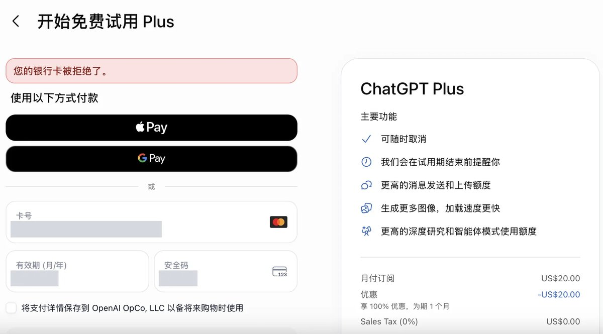
</p>

<p align="center"><sub>AONIR 实拍，2026 年 10 月 27 日：领取一个月免费试用 Plus，当天应付 $0，结账页仍提示「您的银行卡被拒绝了」。「付款未获批」出现在同一个位置。</sub></p>

结账页 7 种提示的中英文原文、每一种先做什么，以及 OpenAI 给的排查顺序，见 [ChatGPT 付款未获批准怎么办](https://aonir.com/guides/chatgpt-payment-not-approved/?utm_source=github&utm_medium=referral&utm_campaign=plus_guide&utm_content=why_hard_declined)。

**结论：** 国内银行发的卡不在官方支持范围内，别反复试；海外卡被拒，先核对账单信息和所在地区。想开 Plus，可以选择海外卡官方直付、海外虚拟卡、美区 Apple ID + 礼品卡，或第三方充值。下面四条路线会分别讲清楚成本、门槛和风险，按自己的设备、支付条件和折腾意愿选择即可。

## 2026 年 ChatGPT 套餐与真实价格

先把「你到底该买哪档」搞清楚，别为用不上的档位多花钱。以下是官网口径（美元、按月），人民币按当时汇率浮动：

| 套餐 | 官方价 | 适合谁 | 关键点 |
| --- | --- | --- | --- |
| Free | $0 | 轻度、偶尔问问题 | 10 月 8 日起普通对话用 GPT-6 Luna，日常文字对话不限次；文件、图片等工具有额度；部分地区带广告 |
| Go | $8 / 月 | 预算敏感、量不大 | 注意：Go 在部分地区仍带广告，且不含旗舰模型 |
| Plus | $20 / 月 | 日常工作、学习与个人编程 | 10 月 7 日起普通对话用 GPT-6，可选到 High 档；更高的模型与工具用量，含 Deep Research、Codex 等；API 单独计费 |
| Pro 100 | $100 / 月 | 高频使用 Work / Codex 的个人用户 | Work / Codex 用量约为 Plus 的 10 倍，没有五小时限制，适合经常遇到用量限制的人 |
| Pro 200 | $200 / 月 | 持续高强度使用的个人用户 | 约为 Plus 的 20 倍，没有五小时限制。10 月 29 日起所有 Pro 200 订阅额度相同，原定下调老订阅额度的计划取消 |
| Pro 500 | $500 / 月 | 全天跑长任务、多个智能体并行 | 约为 Plus 的 50 倍，另有 Ultrafast 高速档 |
| Business | $25 / 席·月（年付 $20 / 席，最少 2 席） | 团队 | 数据默认不用于训练；最少 2 席 |

Pro 三档是 9 月 29 日 OpenAI DevDay 当天改的，倍数出自 [Codex 负责人 Tibo](https://x.com/thsottiaux/status/2104951965184925941) 和 [OpenAI](https://x.com/OpenAI/status/2104993967985381673) 在 X 上的说明，[Pro 200 同一天重新开放](https://x.com/OpenAI/status/2104993969486930015)。美国时间 10 月 29 日，Pro 三档的 Work / Codex 额度翻倍（[OpenAI 帮助中心](https://help.openai.com/en/articles/9793128-about-chatgpt-pro-tiers)），倍数随之变成约 10、20、50 倍，这是 Tibo 的说法（[原帖](https://x.com/thsottiaux/status/2115850175868727621)，50 倍他[亲自确认](https://x.com/thsottiaux/status/2115851811576053881)）；Chat 里 GPT-6 Pro 的每周额度，Pro 100 和 Pro 500 不变，Plus 也不变。

几个容易被忽略的点：

- iOS 内购的 Plus 标价是 $19.99/月（网页端官网是 $20/月），10 月 22 日复核未变。美区 Apple ID 的账单州设为 **Oregon（OR）** 不加销售税，$20 礼品卡刚好够付（[为什么](#apple-billing-oregon)）；礼品卡实付金额和完整步骤见[路线 C](#路线-c支付宝买美区-apple-礼品卡用-iphone-订阅-chatgpt-plus亲测)。订阅只能在 Apple ID 里管理，网页端管不了。
- 选套餐时先分清 **Chat、Work / Codex 和 API**：Work 与 Codex 共用用量，API 另行计费。模型入口与额度按当前账号显示判断，具体可查 [OpenAI 模型说明](https://learn.chatgpt.com/docs/models)及[计划与用量](https://learn.chatgpt.com/docs/pricing)。Codex 装不上、登录要验证手机号、终端连不上，见 [Codex 国内使用与报错速查](https://github.com/Avarce/codex-china-guide)。
- 判断要不要上 Pro，可以先记录一周内触及用量上限的频率，以及是否影响工作；目前的额度够用时，可以继续使用现有套餐。

## 四条路，逐条讲真实成本与风险

### 路线 A：官方直付（有海外卡就选它，最省钱最正规）

**适合谁：** 手里有一张能过 Stripe 的海外信用卡（或能刷海外亲友的卡、绑了海外卡的 PayPal）的人。

**怎么做：** 挂一个稳定干净的美区节点 → chatgpt.com → Settings → Upgrade → 填卡号、有效期、CVV、美国账单地址 → 提交。$20/月 + 当地税。

**真实成本：** 官方原价，没有任何溢价。

**优点：** 最正规，订阅绑在你自己账号上，自动续费、稳定。

**缺点 / 注意：** 前提是「你真有一张能用的海外卡」——绝大多数国内用户卡在这一步，所以才有后面三条路。别用国内双币卡硬试超过一两次，失败多了会给账号累加风控标签。

**变体：** 海外亲友代付。如果家人朋友在国外，可以让他们用自己的卡登录你的账号帮你订阅一次，之后每月自动扣他们的卡，你再按月把钱转给他们。零溢价、最省钱，缺点是对方换卡/销卡时你的订阅会断，得记得结清。适合有稳定海外关系的人，但别把「找陌生代付中介」当成这一类——那本质上是路线 D，还没有售后。

### 路线 B：海外虚拟信用卡（技术党可玩，但 2026 年基本团灭）

**适合谁：** 不怵技术、愿意自己一步步搞、未来还想订别的海外服务的人。

**核心原理：** 在海外发卡平台开一张虚拟 Visa/Mastercard，充值美元，再挂美区节点到官网绑卡支付，相当于把自己变成一个「海外用户」。

2026 年的现实——这条路已经很难走了：

- 前两年国内用户量最大的几家平台接连停运：野卡 WildCard、Depay / Dupay（2025 年底正式关服）、BinGoCard、OneKey 等陆续退场，支持人民币直充的虚拟卡基本绝迹。老用户余额能不能全额提出，全看平台良心。
- 还在运营的，几乎清一色是只支持 USDT 充值的加密 U 卡：要先买币、要过 KYC、开卡费 + 月费 + 手续费叠起来一年多花不少，对普通人门槛很高。
- 平台跑路是真实发生过的风险，这类服务处在跨境支付监管的灰色地带，随时可能消失。

**给还想走这条路的人一条实操建议：** 无论用哪家，别一次性充太多钱进去，单次充够开一次订阅（$25–30）就行，别把大额资金锁在平台里。

**优点：** 一卡多用（Netflix / Spotify 等都能绑）；账号完全自主。

**缺点 / 注意：** 门槛高、只收 USDT 的居多；各种费用叠起来比 $20 贵不少；对隐私敏感的人不友好；平台跑路风险始终悬着。

### 路线 C：支付宝买美区 Apple 礼品卡，用 iPhone 订阅 ChatGPT Plus（亲测）

**适合谁：** 有 iPhone 或 iPad、愿意准备一个美区 Apple ID 的人。订阅最终绑定在你登录的 OpenAI 账号上，开通后网页端、Mac、安卓都能正常使用；只有购买礼品卡、兑换和完成 Apple 内购这几步需要苹果设备。

**先分清两个不同的动作：**

1. **在支付宝切换到美国城市**，是为了在首页找到「大牌礼卡」和 Pockyt 礼品卡入口。
2. **在 App Store 使用美区 Apple ID**，是为了兑换美区礼品卡并用余额支付 ChatGPT Plus。设置账单地址时 State 选 **Oregon（OR）**，不加销售税（[为什么](#apple-billing-oregon)）。

更省事的做法是单独准备一个美区 Apple ID，只用于 App Store 的「媒体与购买项目」；主力 iCloud 账号不必跟着改区。如果你选择把现有 Apple ID 改成美区，Apple 才会要求先用完余额、取消现有订阅并等订阅期结束。改区和付款方式选 None 的步骤见[下文](#apple-id-none)。

**为什么这条路线稳定：** 付款由 Apple App Store 处理，不走 OpenAI 网页端的 Stripe 支付流程。礼品卡进入你自己的美区 Apple ID，ChatGPT Plus 则开通到你本人登录的 OpenAI 账号。

**本次实测成本：** 准备一个月的订阅余额，10 月 13 日复测是 **¥134.44**（7 月 18 日实付 ¥135.98）。汇率会变化，购买时以 Pockyt 和 App Store 页面显示为准；每次的汇率和明细见下面[实测流程](#支付宝买美区礼品卡实测流程附截图)里的表。Pockyt 缺货时用 [SEAGM](#seagm)，11 月 6 日实付 ¥138.13。

**完整流程（建议按这个顺序做）：**

1. **先确认有美区 Apple ID。** 已经有的朋友，请直接看第 2 步买卡。还没有的话，可以把现有 Apple ID 改成美区，不过还是比较推荐重新注册一个美区 Apple ID：更方便，不用来回切换地区，国区账号留着分开使用。付款方式选 None，账单地址填 Oregon（OR），步骤和截图见[下文](#apple-id-none)。
2. **在支付宝买 $20 美区 App Store 礼品卡。** 切到美国城市 → 首页「超值抢购」里的「大牌礼卡低至9折」→ 滑到页面底部点 Pockyshop → 地区选美国，点 App Store & iTunes USA → 填收码邮箱并付款。截图见[实测流程](#支付宝买美区礼品卡实测流程附截图)；首页找不到这个入口或搜不到 Pockyt，用[直达链接](#pockyt-direct-link)。Pockyt 缺货时改用 [SEAGM](#seagm)。
3. **在 App Store 兑换礼品卡，再到 iOS 版 ChatGPT App 里升级 Plus**，用余额付款，确认总额是 $19.99。见[拿到兑换码后](#apple-redeem-subscribe)。新注册的 Apple ID，先买一两个便宜 App 再订，见[这一条](#apple-new-account)。
4. **付款时卡住了：** 提示「必须提供付款信息才能继续购买」，看[账单地址改 Oregon](#apple-payment-info-required)；弹出「购买未完成，提交申请至 Apple 支持以供审核」，看[「购买未完成」怎么办](https://github.com/Avarce/apple-purchase-not-completed)。

<a id="buy-gift-card"></a>

> **还没有美区 Apple ID 的话**，可以先看下面的[准备美区 Apple ID](#apple-id-none)（比较推荐新注册一个）；已经有的话，直接往下看怎么买卡就好。

**买卡渠道怎么选：**

- **推荐：** 有公司主体、运营多年、能用支付宝付款的平台。本文实测过两家：Pockyt（在支付宝里直接买，下面是完整流程和截图）和 SEAGM（[Pockyt 缺货时的备用](#seagm)）。来源可查，比淘宝/闲鱼的低价卡密稳得多；其他渠道我们没实测，这里不介绍。
- **不推荐：** 淘宝/闲鱼上明显低于面值的卡密，来源查不到。按 Apple 的[礼品卡条款](https://www.apple.com/legal/internet-services/itunes/giftcards/us/terms.html)，Apple 怀疑礼品卡来路不正时，可以作废这张卡、不退款，也可以停用账户。

**用电脑直接进官网：**

<table>
  <tr>
    <td width="200" align="center"><a href="https://shop.pockyt.io"></a></td>
    <td><a href="https://shop.pockyt.io"><b>Pockyt Shop</b></a> · 官网 shop.pockyt.io<br>本文主推的买卡渠道。手机在支付宝里买（<a href="#支付宝买美区礼品卡实测流程附截图">实测流程</a>）；电脑打开官网登录后也能买，付款方式有支付宝、微信支付（<a href="#pockyt-web">电脑上怎么买</a>）。</td>
  </tr>
  <tr>
    <td width="200" align="center"><a href="https://www.seagm.com/zh-cn/apple-gift-card-us"></a></td>
    <td><a href="https://www.seagm.com/zh-cn/apple-gift-card-us"><b>SEAGM</b></a> · 官网 seagm.com<br>Pockyt 缺货时的备用，支付宝付款，<a href="#seagm">11 月 6 日实测</a>。开着代理打不开，就关掉代理直接打开。</td>
  </tr>
  <tr>
    <td width="200" align="center"><a href="https://aonir.com/?utm_source=github&amp;utm_medium=referral&amp;utm_campaign=plus_guide&amp;utm_content=brand_card"></a></td>
    <td><a href="https://aonir.com/?utm_source=github&amp;utm_medium=referral&amp;utm_campaign=plus_guide&amp;utm_content=brand_card"><b>AONIR</b></a> · 官网 aonir.com<br>不想自己买卡、改美区 Apple ID：本文维护方 AONIR，可以用微信付款，会员充到你本人的 ChatGPT 账号，不需要 ChatGPT 登录密码。</td>
  </tr>
</table>

#### 支付宝买美区礼品卡：实测流程（附截图）

这六步都在支付宝里完成，人民币付款；之后再到 App Store 兑换并订阅。下面把「汇率参考」和「实际付款」分开写，避免把市场换算价误当成最终成交价：

| 项目 | 核对结果 |
| --- | --- |
| 即时汇率参考（2026-07-18 17:09 UTC） | $19.99 ≈ ¥135.40 |
| Pockyt 实际成交（2026-07-18） | $20 美区礼品卡实付 ¥135.98，汇率 1 USD = 6.81244 CNY |
| Pockyt 付款页复测（2026-10-13 02:40 北京时间） | 同一张卡 ¥134.44，汇率 1 USD = 6.73527 CNY，订单金额 $19.96 |
| ChatGPT iOS 内购（账单州 Oregon） | $19.99，无额外销售税 |
| 付款后余额 | 兑换 $20 后支付一个月，Apple ID 余额剩 $0.01 |

**Pockyt Shop 是谁：** 美国支付公司 Pockyt 开的礼品卡商店。Pockyt 2017 年成立，总部在纽约，原名 Yuansfer，做线上线下收款，商家用它接支付宝、PayPal 等主流电子钱包付款，拿过 500 万美元种子轮融资（[2022 年 1 月的新闻稿](https://www.globenewswire.com/news-release/2022/01/13/2366358/0/en/Leading-Payments-Platform-Pockyt-Announces-Partnership-With-Delaware-North-Enabling-Contactless-QR-Code-Payments-For-Consumers-Using-Alipay-PayPal-and-Other-Popular-Digital-Wallets.html)）。[Pockyt 官网](https://pockyt.io)写明，公司主体 Yuansfer, Inc.（NMLS #2126922）在所列的美国各州持牌或获准经营汇款业务。Pockyt Shop 的[礼品卡条款](https://shop.pockyt.io/terms)（2022 年 10 月 8 日更新）写明：礼品卡由合作的零售商提供和兑现，卖出后不退（购买出错没买成的除外），客服邮箱 shopsupports@pockyt.io，地址在纽约华尔街 40 号。网页版 11 月 6 日列着 226 种礼品卡；支付宝首页的「大牌礼卡」活动页里也有它的入口。

**入口是 2026 年 10 月 28 日实测的。** 支付宝首页的活动位会跟着活动换：这次的入口在首页「超值抢购」里，卡片标着「秋季限定」，活动结束后可能又会换位置。以前的入口是底部「Coupons」→「大牌礼卡」，Pockyt Shop 首页的横幅上现在还是这样写的（「优惠」菜单 → 大牌礼卡），首页找不到时可以再试试。两处都找不到，直接用下面的[直达链接](#pockyt-direct-link)。进了 Pockyt Shop，先点右上角的星标收藏（第 ⑥ 步），以后入口再换也不用重新找。

<table>
  <tr>
    <td width="33%" valign="top" align="center">
      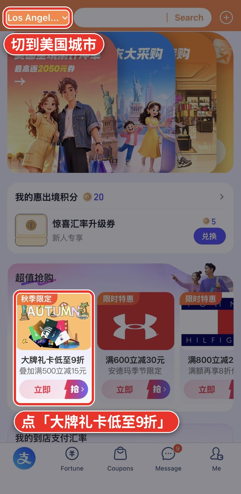<br>
      <b>①</b> 支付宝<b>左上角</b>把定位切到<b>美国任意城市</b>（图里是洛杉矶），在首页<b>「超值抢购」</b>里点<b>「大牌礼卡低至9折」</b>
    </td>
    <td width="33%" valign="top" align="center">
      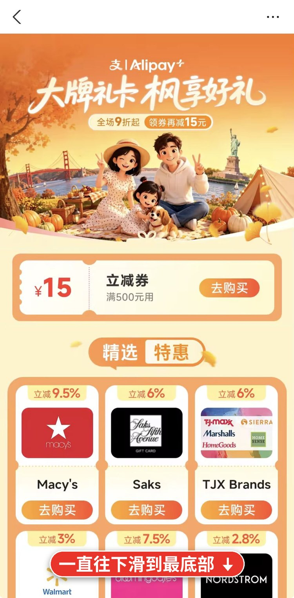<br>
      <b>②</b> 进入「大牌礼卡 枫享好礼」活动页，<b>一直往下滑到最底部</b>
    </td>
    <td width="33%" valign="top" align="center">
      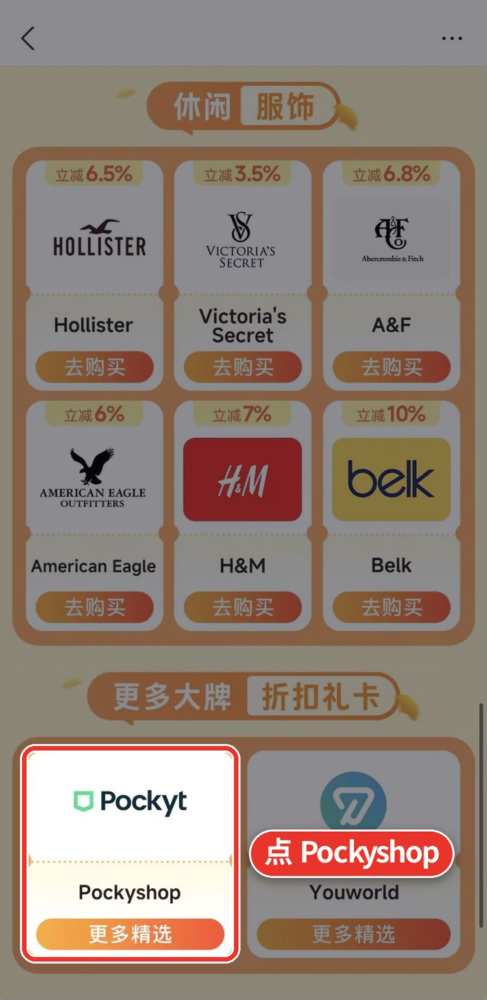<br>
      <b>③</b> 在最底部的「更多大牌 折扣礼卡」里点 <b>Pockyshop</b>
    </td>
  </tr>
  <tr>
    <td width="33%" valign="top" align="center">
      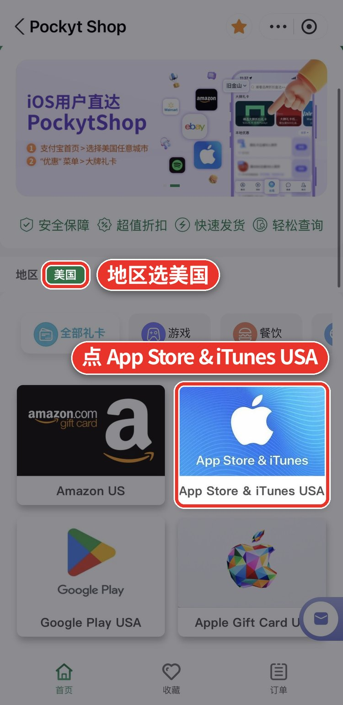<br>
      <b>④</b> 进入 Pockyt Shop，<b>地区选美国</b>，点 <b>App Store &amp; iTunes USA</b>，填邮箱、选面额（<b>直接选 $20，别卡着 $19.99</b>）
    </td>
    <td width="33%" valign="top" align="center">
      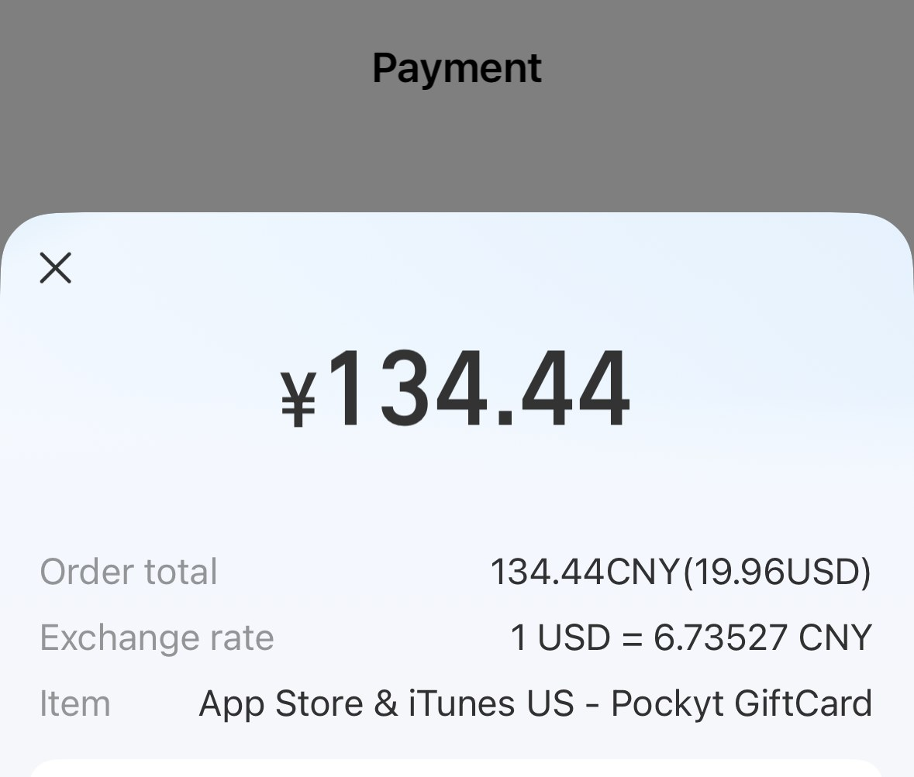<br>
      <b>⑤</b> 支付宝付款：<b>$20 礼品卡 ¥134.44</b>（2026-10-13 复测；7 月实付 ¥135.98），汇率透明、没有高溢价
    </td>
    <td width="33%" valign="top" align="center">
      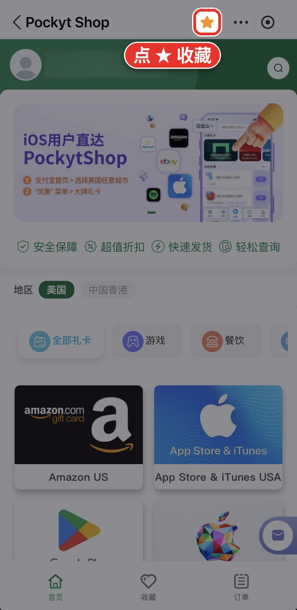<br>
      <b>⑥</b> <b>记得收藏：</b>点 Pockyt Shop 右上角的 <b>★</b>。以后活动入口换了或者下线了，从支付宝的收藏里还能直接打开
    </td>
  </tr>
</table>

买好以后，已经有美区 Apple ID 的话，可以直接跳到[拿到兑换码后](#apple-redeem-subscribe)；还没有的话，先看[准备美区 Apple ID](#apple-id-none)。支付宝里找不到入口、想用电脑买，或者 Pockyt 缺货，可以看下面几段。

<a id="pockyt-direct-link"></a>

#### 找不到「大牌礼卡」或搜不到 Pockyt：用直达链接

2026 年 10 月 9 日有读者在 [Issue #1](https://github.com/Avarce/chatgpt-plus-china-guide/issues/1) 反馈：支付宝切到美国城市后，界面里找不到「大牌礼卡」，搜索也搜不到 Pockyt。遇到这种情况，跳过上面的第 ①–③ 步，用链接直接进 Pockyt Shop：

```
https://ur.alipay.com/_5pdWVYNxT2sYKHaPeYkNZh
```

<table>
  <tr>
    <td width="50%" valign="top" align="center">
      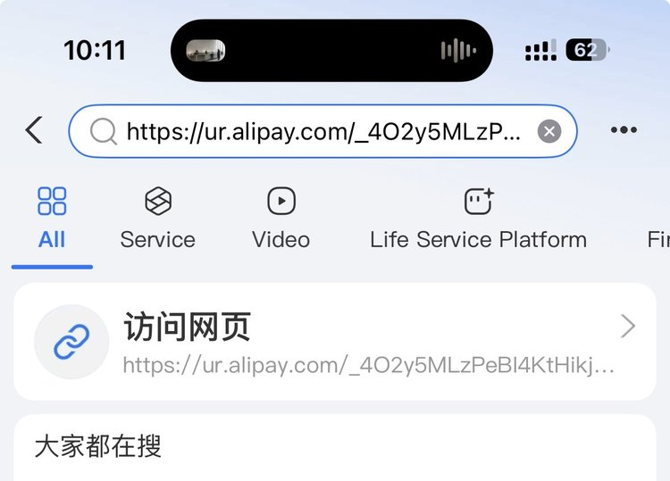<br>
      <b>①</b> 复制上面的链接，粘贴到支付宝<b>顶部搜索框</b>，点结果里的<b>访问网页</b>
    </td>
    <td width="50%" valign="top" align="center">
      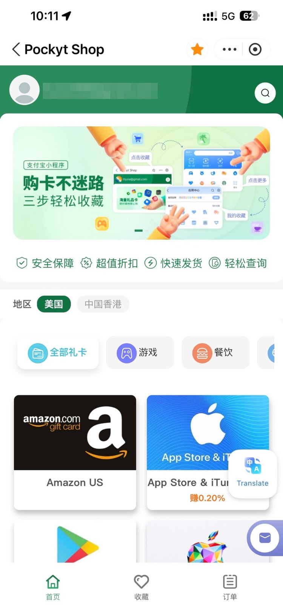<br>
      <b>②</b> 直接进入 Pockyt Shop。<b>地区选美国</b>，点 <b>App Store &amp; iTunes</b>，再填邮箱、选面额并付款，同上面的第 ④、⑤ 步
    </td>
  </tr>
</table>

这条链接是 2026 年 10 月 9 日给出的，要粘贴到支付宝里打开。截图搜索框里显示的是另一次分享生成的链接，以正文这条为准。进去以后同样点右上角的星标收藏（第 ⑥ 步），下次不用再找入口。哪天链接失效了，请到 [Issue #1](https://github.com/Avarce/chatgpt-plus-china-guide/issues/1) 说一声。

<a id="pockyt-web"></a>

#### 用电脑买：Pockyt Shop 官网（shop.pockyt.io）

Pockyt 客服邮件里写的官方网站是 [shop.pockyt.io](https://shop.pockyt.io)，用电脑操作更方便。11 月 6 日打开看过：右上角登录 / 注册，左上角地区选美国，在「全部礼卡」里点 App Store & iTunes USA，输入面额 USD 20，付款方式里有支付宝和微信支付。网页版我们没有实测付款，流程和支付宝里买大致一样。

<p align="center">
  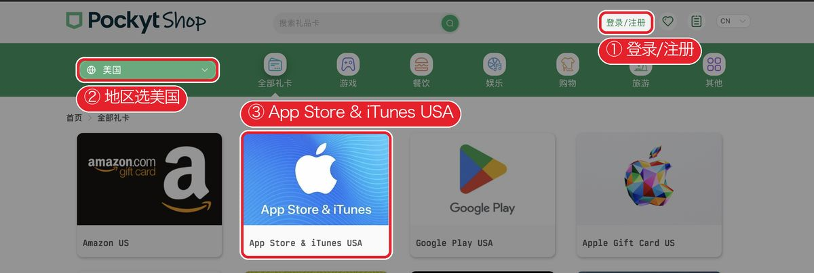
</p>

<p align="center">
  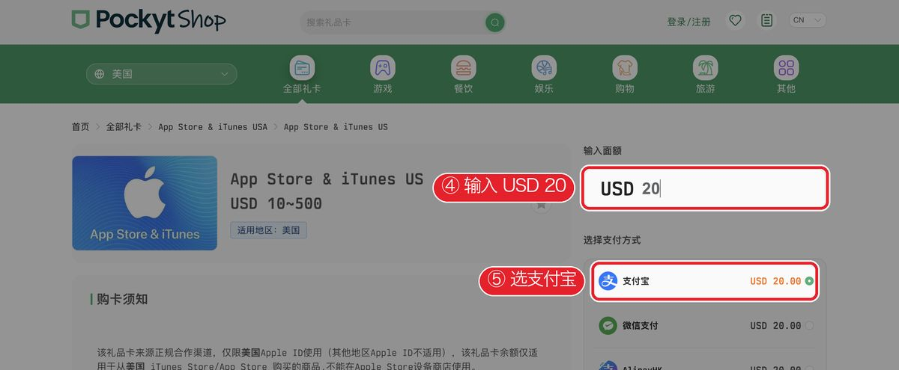
</p>

<a id="pockyt-status"></a>

#### Pockyt Shop 现在还能买吗？（11 月 6 日已补货）

| 日期 | 状态 | 来源 |
| --- | --- | --- |
| 10 月 22 日 | 在售：固定面额 $10–200，另有 $2~500 自选 | 我们打开看过 |
| 10 月 28 日 | 读者按新入口买到礼品卡、充值成功 | [Issue #1](https://github.com/Avarce/chatgpt-plus-china-guide/issues/1) |
| 11 月 4 日 | 缺货，客服当晚回复已补货 | Issue #1 读者反馈，[客服回复](https://github.com/Avarce/chatgpt-plus-china-guide/issues/1#issuecomment-6632083340) |
| 11 月 5 日 | 又卖完了，客服回复**暂无明确的补货时间** | Issue #1 读者反馈，[客服回复截图](images/pockyt-support-reply-20261105.jpg) |
| 11 月 6 日 | **已补货**：客服中午回信「现已到货，可以正常下单购买」，我们当天打开核实有货 | [客服回信截图](images/pockyt-support-restock-20261106.jpg) |

补货后照常按上面的支付宝流程买就行。11 月 4 日、5 日接连卖完过，再遇到缺货可以用下面的[备用渠道 SEAGM](#seagm)，同样能用支付宝买苹果美区礼品卡。补货时间可以在微信公众号 PockytShop 里找在线客服问；你看到 Pockyt 缺货或补货了，请到 [Issue #1](https://github.com/Avarce/chatgpt-plus-china-guide/issues/1) 说一声。订 Plus 选 $20 就够。

<p align="center">
  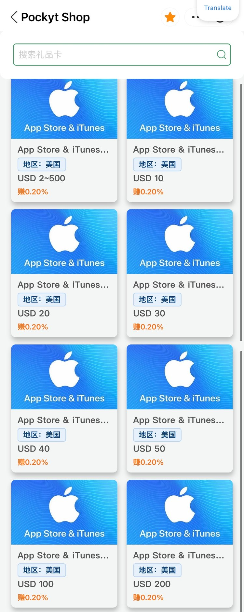
</p>

<p align="center"><sub>支付宝里的 Pockyt Shop 商品页（2026 年 10 月 22 日截图）：地区选美国后，App Store & iTunes 礼品卡有 $2~500 自选金额和 $10、$20、$30、$40、$50、$100、$200 几档固定面额，订 Plus 选 $20 就够。</sub></p>

<a id="seagm"></a>

#### Pockyt Shop 缺货怎么办：用 SEAGM 买美区礼品卡（支付宝付款，11 月 6 日实测）

11 月 5 日 Pockyt 的美区卡又卖完了（11 月 6 日中午已补货）。我们 11 月 6 日凌晨用 iPhone 实测了 SEAGM 官网（seagm.com），从注册到兑换成功：

| 项目 | 实测结果（2026-11-06，北京时间） |
| --- | --- |
| 买的卡 | Apple 礼品卡(美国)，20 美金 |
| 价格 | 原价 ¥142.40，折扣 3%（-¥4.27），**支付宝实付 ¥138.13**，结账页没有另加手续费 |
| 到卡时间 | 03:03 付款，「我的卡密」先显示「待发货」，刷新几次页面，03:06 出现「显示卡片」 |
| 兑换 | App Store 兑换成功，美区 Apple ID 余额 $20.00 |

比 Pockyt 10 月 13 日复测的 ¥134.44 贵 ¥3.69。支付宝收银台按马来西亚林吉特换算（当时 1 MYR = 1.65861 CNY），实际扣款就是页面上的 ¥138.13。

**SEAGM 是谁：** 马来西亚的老牌游戏点卡、礼品卡平台，2007 年从霹雳州实兆远（Sitiawan）的一间小办公室起家，现在在吉隆坡、中国和泰国都有办公室，支持 390 多种付款方式（[Pokde.net 的介绍](https://pokde.net/blog/seagm-digital-gaming-marketplace)，2025 年更新）。2022 年它公布的数字是社区用户超过 1080 万、商品和服务超过 1 万种，2014 年起是马来西亚 MSC Status 认证企业（政府给数字经济企业的资格认证；[TripleA 新闻稿](https://www.triple-a.io/newsroom/leading-gaming-e-commerce-platform-seagm-enables-digital-currency-payments-through-triplea)）。现在网站页脚写的运营公司是 SEA Gamer Mall Sdn Bhd（2012 年注册，公司注册号 201201016057）。这款卡的商品页显示 19.5 万条评价、平均 4.99 分（SEAGM 站内数据）。商品页写明：美国卡只能兑换到美区 Apple 账户；买错地区或买了不用，按 SEAGM 的退款条款（Refund Policy）处理。

**和 Pockyt 比：**

| | Pockyt Shop | SEAGM |
| --- | --- | --- |
| 在哪买 | 支付宝里直接打开 | 浏览器打开网站，付款时跳到支付宝（我们实测用的是手机） |
| 要准备什么 | 一个收码邮箱 | 注册账号（邮箱验证码 + 密码），第一次付款前绑手机号 |
| $20 卡实付 | ¥134.44（10-13 复测） | ¥138.13（11-06 实测） |
| 面额 | $10–200 固定面额，另有 $2~500 自选 | $2 到 $500 的固定面额，订 Plus 选 $20 |
| 兑换码在哪看 | 下单邮箱，或 Pockyt Shop 的「订单」 | SEAGM 的「我的卡密」，要再输一次登录密码；邮箱只收到到货通知 |
| 库存 | 11-05 缺货，11-06 中午补货 | 11-06 实测有货 |

**开始前注意：**

1. **关掉代理（节点）再打开。** 开着代理打开 seagm.com，可能显示 Error 1005 / Access denied：网站拦了部分机房 IP，我们用的节点就被拦了。关掉代理、用国内网络直接打开就正常。商品页直达：`https://www.seagm.com/zh-cn/apple-gift-card-us`（11 月 6 日从国内网络打开正常）。
2. **右上角是 ZH-CN / CNY。** 用人民币结算，付款方式选支付宝。SEAGM 帮助中心的 [Alipay 付款说明](https://help.seagm.com/hc/en-cn/articles/21539912817305)（2026 年 1 月 22 日更新）写明：支付宝只供中国大陆用户使用；每次结账可能自动加收手续费，费率会变。我们这次结账页没有另加手续费，付款前以结账页金额为准。
3. **选「Apple 礼品卡(美国)」。** 列表里还有「iTunes 礼品卡(美国)」「iTunes 礼品卡(土耳其)」，我们实测的是卡面写着 Apple Gift Card 的这一张。
4. **默认面额是 2 美金，记得改成 20 美金。** iOS 内购的 Plus 是 $19.99，账单州设为 Oregon 不加税（见[下文](#apple-billing-oregon)），$20 刚好够。
5. **用电脑也可以，可能更方便。** 我们是在 iPhone 的浏览器里实测的。按上面那篇 SEAGM 的支付宝说明，电脑上结账时选支付宝，页面会显示支付宝二维码，用手机支付宝「扫一扫」付款，之后在「My Orders」里看订单。用电脑买的读者，欢迎在 [Issue #1](https://github.com/Avarce/chatgpt-plus-china-guide/issues/1) 反馈一下顺不顺。
6. **大额卡我们没试过。** 这次买 $20，只要求绑手机号。LINUX DO 上有人发帖问 200 美元的卡为什么买不了；要买大额，先问 SEAGM 右下角的在线客服（LiveChat）再付款。订 Plus 只需要 $20。

**第一次用：注册账号**

<table>
  <tr>
    <td width="33%" valign="top" align="center">
      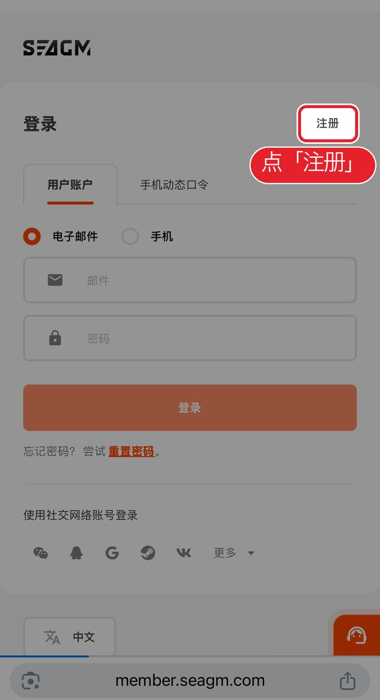<br>
      <b>①</b> 打开 seagm.com，点右上角<b>「登录」</b>，再点<b>「注册」</b>
    </td>
    <td width="33%" valign="top" align="center">
      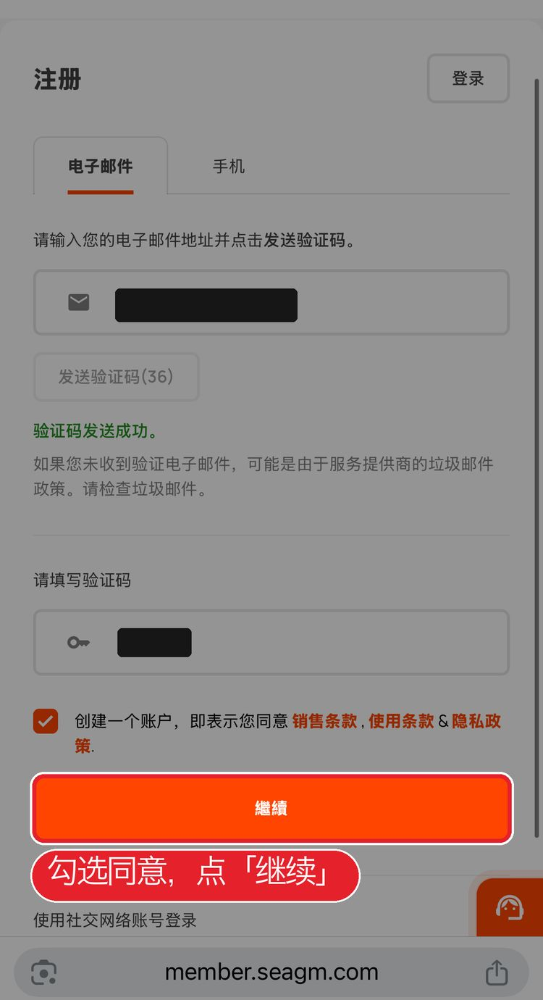<br>
      <b>②</b> 填邮箱，点<b>「发送验证码」</b>，填邮件里的 6 位验证码，勾选同意条款，点<b>「继续」</b>
    </td>
    <td width="33%" valign="top" align="center">
      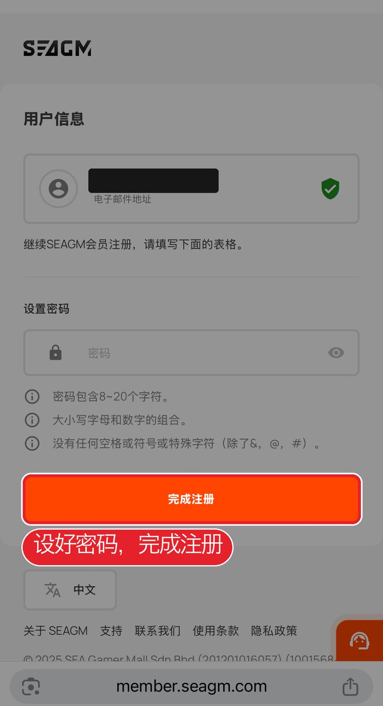<br>
      <b>③</b> 设密码（8–20 位，大小写字母加数字），点<b>「完成注册」</b>。以后看兑换码还要输这个密码
    </td>
  </tr>
</table>

**选卡下单**

<table>
  <tr>
    <td width="33%" valign="top" align="center">
      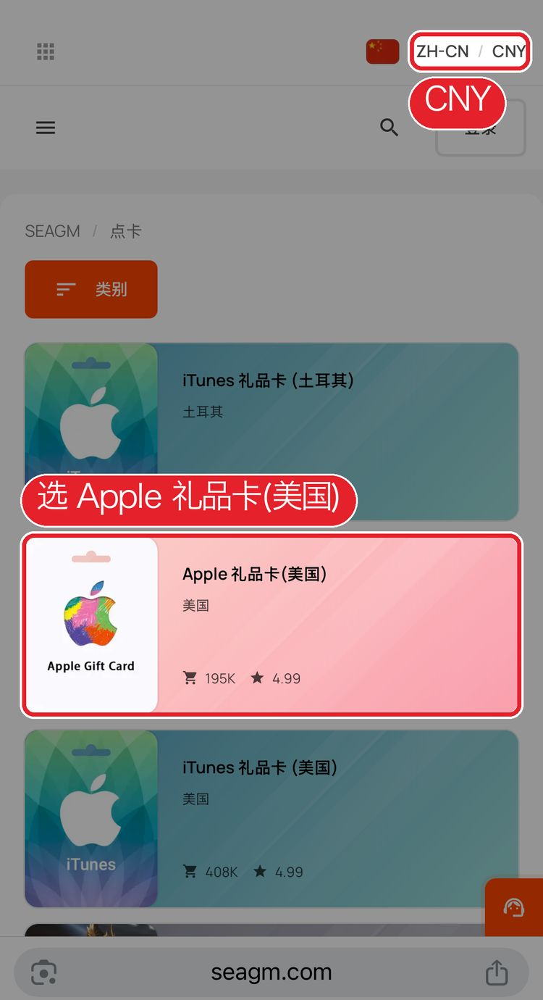<br>
      <b>④</b> 在站内搜 Apple，选粉色的<b>「Apple 礼品卡(美国)」</b>，右上角确认是 <b>CNY</b>。用上面的直达链接会直接到第 ⑤ 步
    </td>
    <td width="33%" valign="top" align="center">
      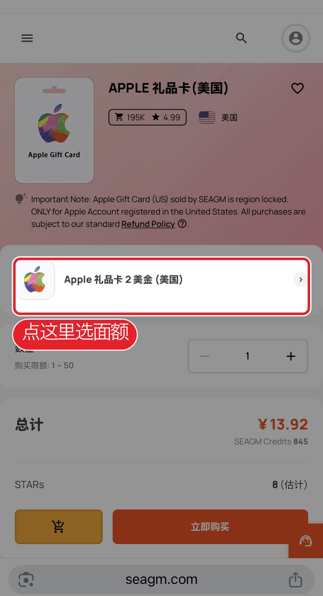<br>
      <b>⑤</b> 商品页默认是 <b>2 美金</b>，点这一栏换面额
    </td>
    <td width="33%" valign="top" align="center">
      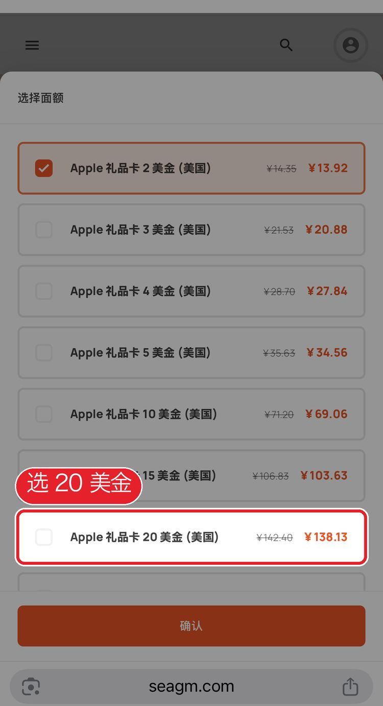<br>
      <b>⑥</b> 选<b>「Apple 礼品卡 20 美金(美国)」</b>，¥138.13，点<b>「确认」</b>
    </td>
  </tr>
  <tr>
    <td width="33%" valign="top" align="center">
      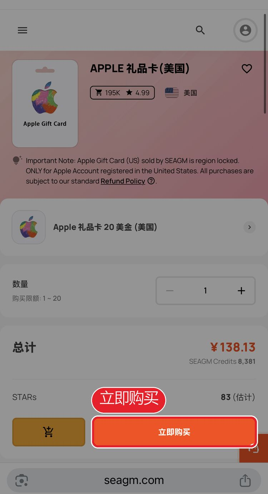<br>
      <b>⑦</b> 总计 ¥138.13，点<b>「立即购买」</b>
    </td>
    <td width="33%" valign="top" align="center">
      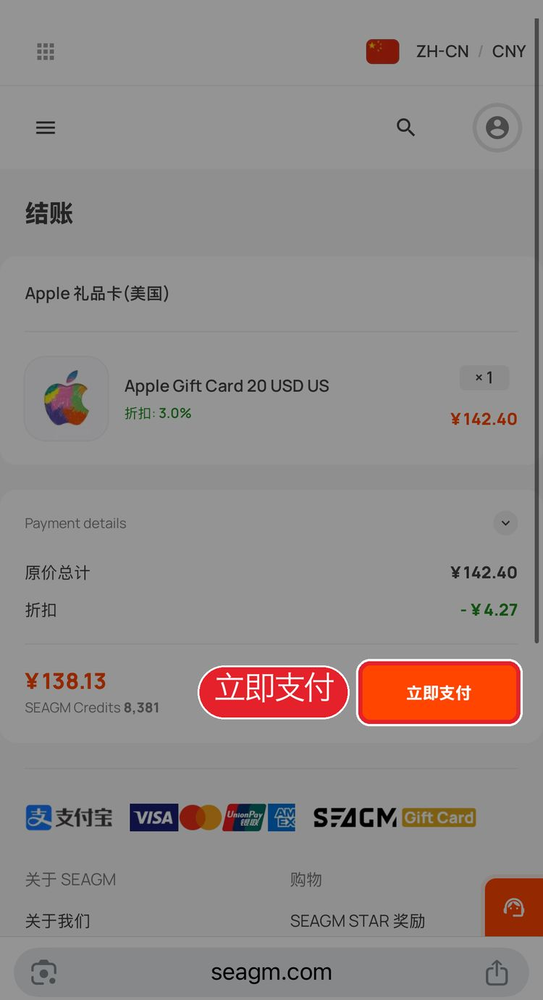<br>
      <b>⑧</b> 结账页：原价 ¥142.40，折扣 3%，应付 ¥138.13，点<b>「立即支付」</b>
    </td>
    <td width="33%" valign="top" align="center">
      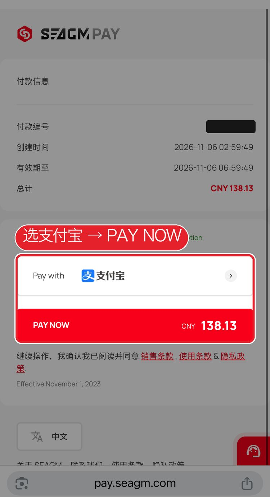<br>
      <b>⑨</b> 付款页确认是 <b>Pay with 支付宝</b>，点 <b>PAY NOW</b>
    </td>
  </tr>
</table>

**第一次付款：先绑手机**

<table>
  <tr>
    <td width="33%" valign="top" align="center">
      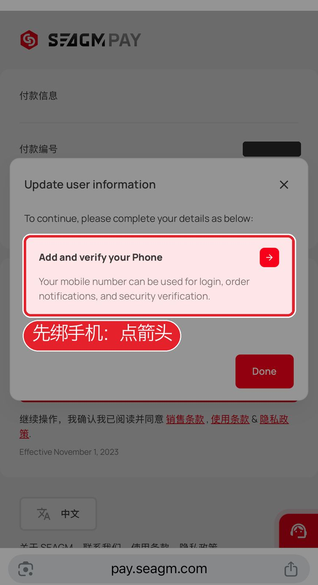<br>
      <b>⑩</b> 第一次付款会弹出 <b>Update user information</b>，要先绑手机：点右边的<b>箭头</b>
    </td>
    <td width="33%" valign="top" align="center">
      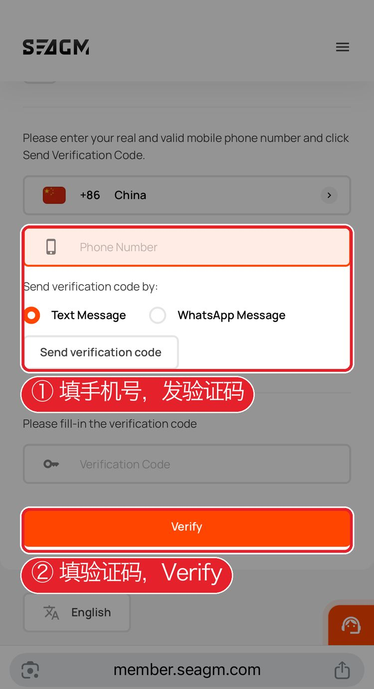<br>
      <b>⑪</b> 选 +86，填手机号，点 <b>Send verification code</b>，填短信验证码，点 <b>Verify</b>
    </td>
    <td width="33%" valign="top" align="center">
      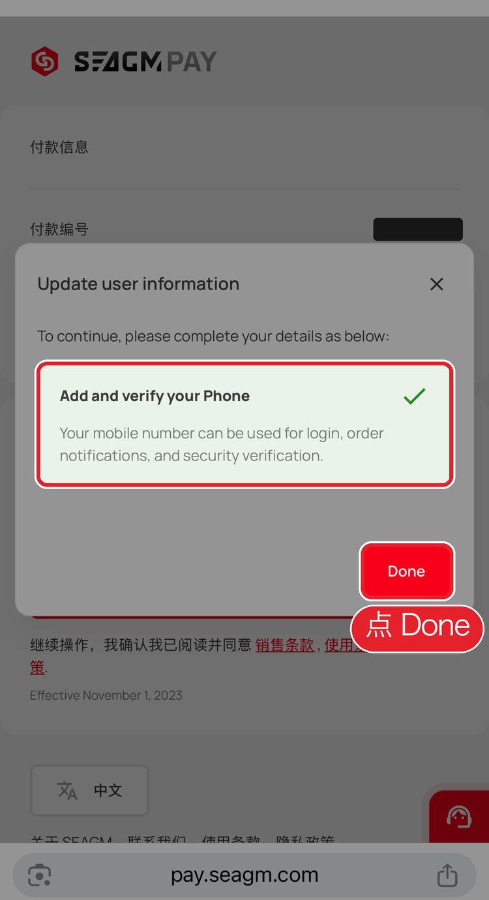<br>
      <b>⑫</b> 回到弹窗显示<b>绿勾</b>，点 <b>Done</b>，再点一次 <b>PAY NOW</b>
    </td>
  </tr>
</table>

**支付宝付款，拿兑换码，兑换**

<table>
  <tr>
    <td width="33%" valign="top" align="center">
      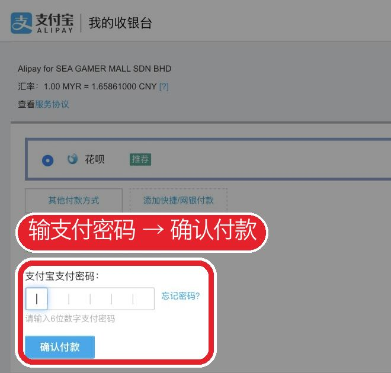<br>
      <b>⑬</b> 跳到支付宝收银台：输入 6 位<b>支付密码</b>，点<b>「确认付款」</b>。要求先登录的，按页面提示登录支付宝。收银台可能默认选花呗，想用余额或银行卡点「其他付款方式」
    </td>
    <td width="33%" valign="top" align="center">
      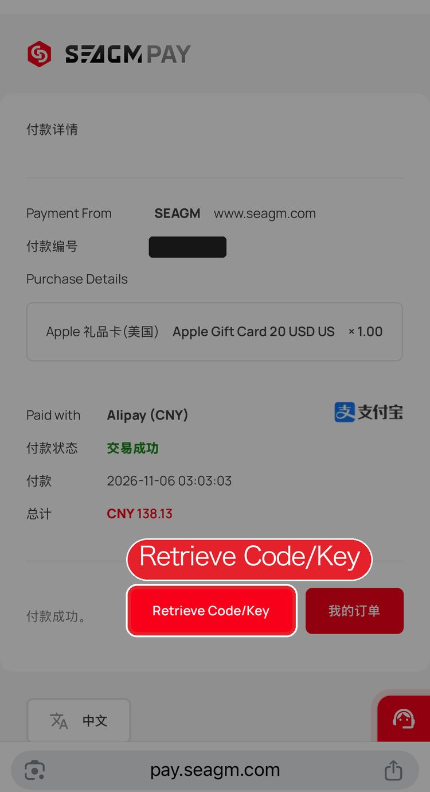<br>
      <b>⑭</b> 付款成功，页面自动跳回 SEAGM，显示<b>交易成功</b>，点 <b>Retrieve Code/Key</b>
    </td>
    <td width="33%" valign="top" align="center">
      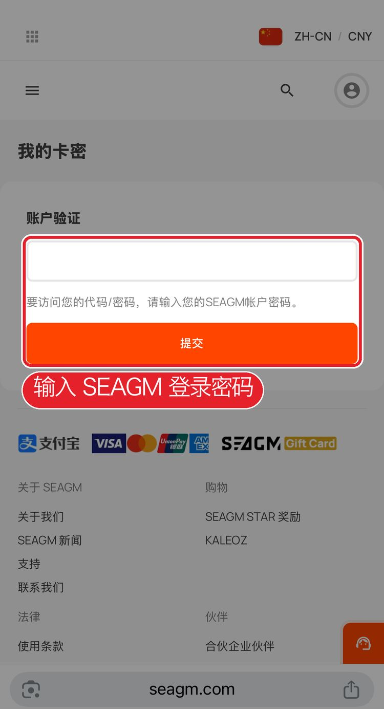<br>
      <b>⑮</b> 输入 SEAGM 的<b>登录密码</b>，点<b>「提交」</b>
    </td>
  </tr>
  <tr>
    <td width="33%" valign="top" align="center">
      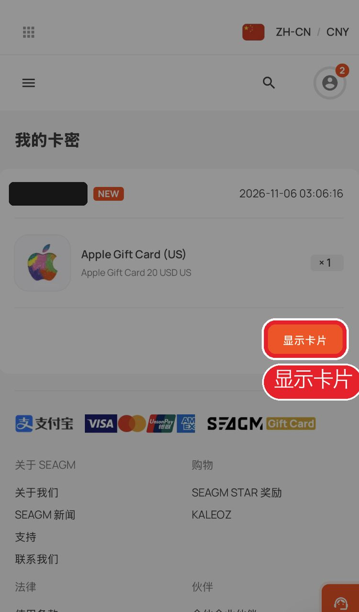<br>
      <b>⑯</b> 刚付完显示「待发货」，<b>多刷新几次页面</b>，这次约 3 分钟后出现<b>「显示卡片」</b>，点它。邮箱也会收到 Orders Are Ready 通知
    </td>
    <td width="33%" valign="top" align="center">
      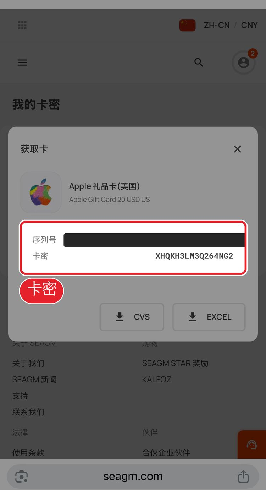<br>
      <b>⑰</b> 兑换码（SEAGM 页面上叫「卡密」）是 16 位字母和数字，复制下来（图里这张已经兑换）
    </td>
    <td width="33%" valign="top" align="center">
      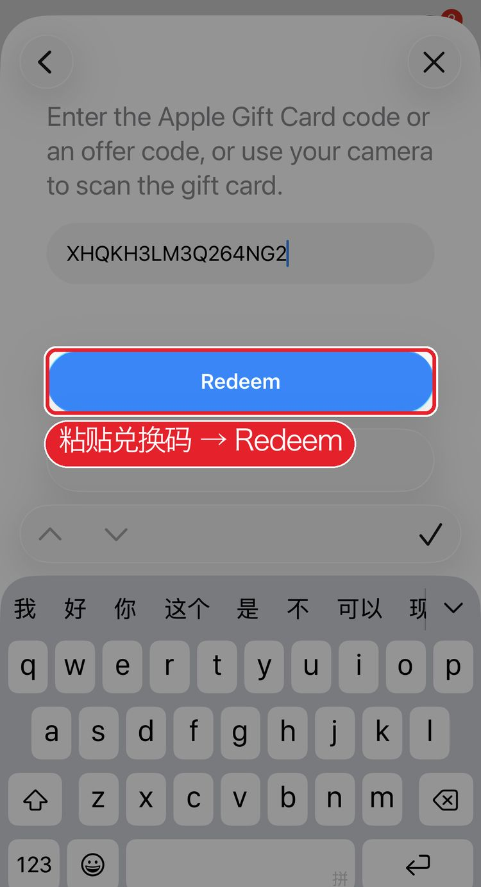<br>
      <b>⑱</b> App Store → 右上角头像 → Redeem Gift Card or Code（中文界面是「兑换代码」），粘贴兑换码，点 <b>Redeem</b>
    </td>
  </tr>
</table>

<p align="center">
  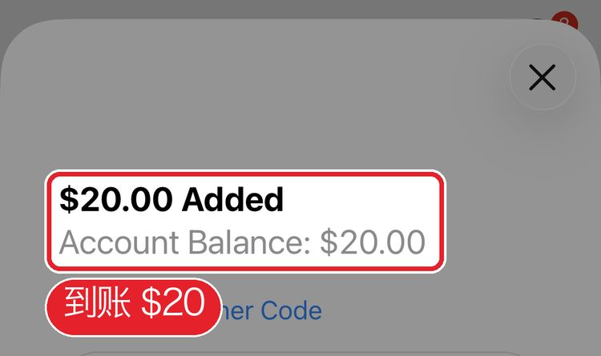<br>
  <b>⑲</b> 显示 <b>$20.00 Added</b>，余额 $20.00，兑换成功
</p>

兑换以后和 Pockyt 买的卡一样：到 iOS 版 ChatGPT App 里升级 Plus，用余额付 $19.99，见[拿到兑换码后](#apple-redeem-subscribe)。这是我们一次完整的实测，说明流程走得通、卡能兑换；价格和库存以 SEAGM 页面为准。

<a id="apple-id-none"></a>

#### Apple ID 改成美区：付款方式选 None（附截图）

**已经有美区 Apple ID 的话，这一节可以跳过，直接往下看[兑换和订阅](#apple-redeem-subscribe)。** 还没有的话有两种办法：比较推荐**重新注册一个美区 Apple ID**，更方便，不用来回切换地区，国区账号留着分开使用；注册时国家或地区选美国，付款方式选「无」（Apple 的[创建账户说明](https://support.apple.com/zh-cn/108647)里这一步可以选「无」），账单地址填 Oregon；另一种是把现有 Apple ID 改成美区。下面是改区的实测（2026 年 10 月 16 日，电脑浏览器，全程不用绑卡）。

**动手前先开美国节点**，用全局模式，尽量选干净的 IP。付款方式里能不能选 None，和 Apple 判断你当前在哪里有关，原因见下面的[看不到 None 怎么办](#apple-id-none-missing)。

**① 个人信息 → 国家/地区。** 打开 [account.apple.com](https://account.apple.com)（旧地址 appleid.apple.com 会跳到这里），登录要改区的 Apple ID，在「个人信息（Personal Information）」里点「国家/地区（Country / Region）」。

<p align="center">
  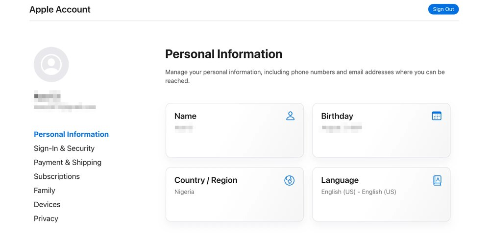
</p>

**② 选 United States，点 Continue。** 弹窗会提示改完地区后要更新付款方式，下一步就是。

<p align="center">
  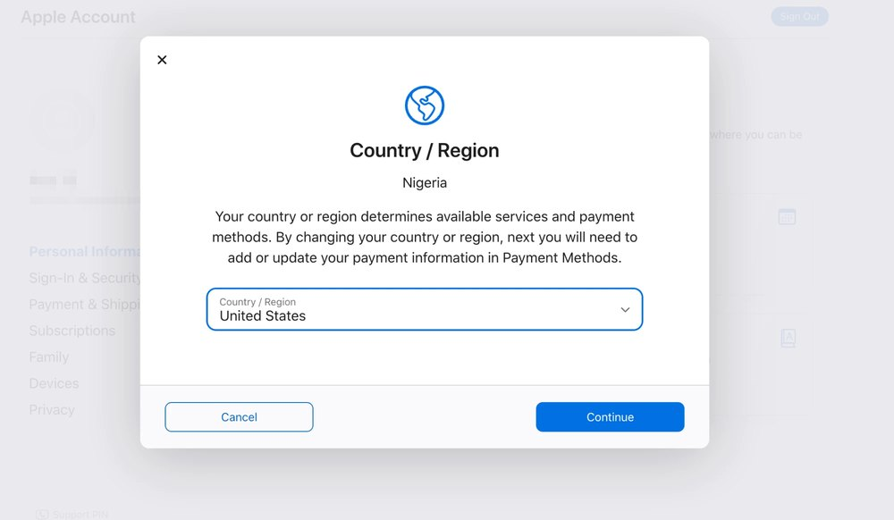
</p>

**③ 点开 Payment Type 下拉框，选最后一项 None。** 弹出「New Payment Method」时，Payment Type 默认显示 Credit / Debit Card，下面跟着一排填卡的输入框，看起来像必须绑卡。点开这个下拉框，None 在最后一项。选好后，下面的姓名和账单地址照常填写，State 选 **Oregon（OR）**，City、ZIP 和电话也填 Oregon 的，和 State 对得上，再点 Save Changes。

<p align="center">
  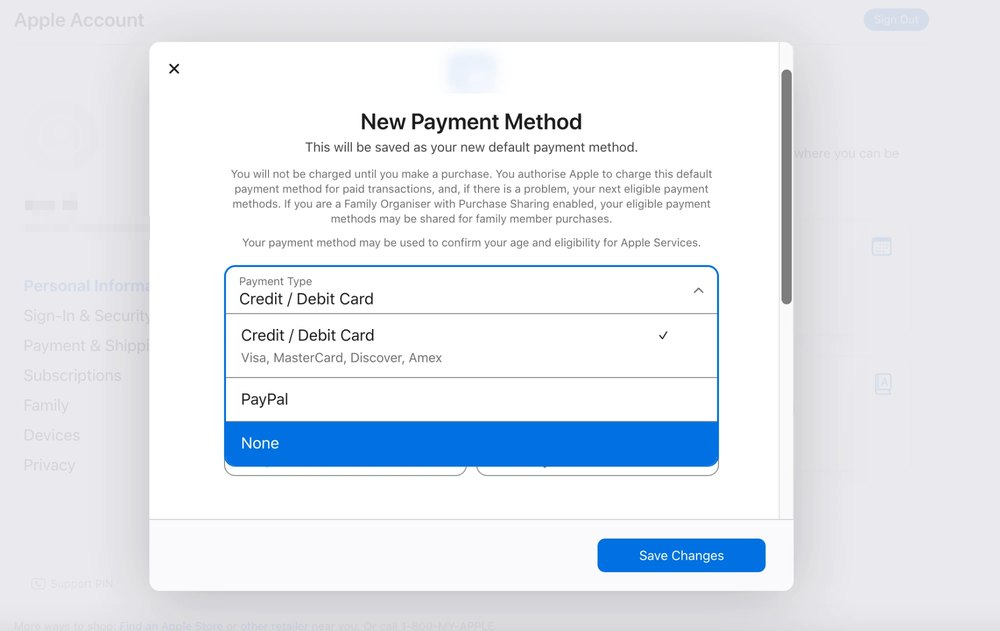
</p>

用 iPhone 改也可以，Apple 给的路径是：设置 → 你的姓名 → 媒体与购买项目 → 国家/地区。中文界面下 None 显示为「无」。

<a id="apple-billing-oregon"></a>

**免税州设置：** 美区 Apple ID 的账单州选择 **Oregon（OR）**。[Oregon 州税务局](https://www.oregon.gov/dor/programs/businesses/Pages/sales-tax.aspx)明确说明该州不征一般销售税，因此 ChatGPT iOS 内购应按页面标价 $19.99 结算。设置完成后，付款前再确认结算页总额确实是 $19.99。

这一步不能省。Apple 在美国按账单地址收销售税，州、县、市、区都按账单地址认定（见 Apple 开发者文档的[交易税报告字段说明](https://developer.apple.com/help/app-store-connect/reference/transaction-tax-report-fields)）。$20 礼品卡付完 $19.99 只剩 $0.01，账单地址在收税的州，加上税就超过余额，付款时会提示「必须提供付款信息才能继续购买」，处理办法见[下文](#apple-payment-info-required)。

<a id="apple-id-none-missing"></a>

##### 看不到 None 怎么办

按下表从上往下排查。第 2 到第 5 条依据 Apple 官方支持文章：[更改 Apple 账户国家或地区](https://support.apple.com/zh-cn/118283)、[从 Apple 账户中移除付款方式](https://support.apple.com/zh-cn/118291)。

| 先查什么 | 为什么没有 None | 怎么处理 |
| --- | --- | --- |
| 1. 有没有点开 Payment Type | None 收在下拉框里，默认显示的是 Credit / Debit Card | 点开下拉框，看最后一项 |
| 2. 当前是不是在美国 | Apple 的说明是：改区时可能要为新地区填付款方式，不想填的话，要等本人到了那个国家或地区再操作。Apple 没写怎么判断位置，我的经验是开着美国节点时能看到 None | 开美国节点的全局模式，退出 account.apple.com 重新登录，再改一次 |
| 3. 账号有没有欠款 | 有未付款项时，Apple 可能不让移除付款方式，只能更换 | 改区前先在原地区把欠款付清（例如国区账号绑支付宝或微信付掉），再改 |
| 4. 有没有生效中的订阅 | 有 iCloud+ 等订阅时，账号必须至少保留一种付款方式 | 设置 → 你的姓名 → 订阅，全部取消，等当前订阅期结束再改 |
| 5. 有没有加入家人共享 | 家庭组织者开着「购买项目共享」时必须保留付款方式；家庭成员可能根本改不了地区 | 组织者先关掉「购买项目共享」；成员先退出家庭组 |
| 6. 选了 None，保存不了 | 账单信息没填全 | 姓名、街道、城市、State、5 位邮编、电话逐项填好，State 选 Oregon（OR），城市和邮编也用 Oregon 的 |

**都排除了还是没有 None？** 换一个新注册的 Apple ID，专门用于美区 App Store，也就是上面推荐的做法。Apple 对不想填付款方式的人，给的办法也是到当地后新建账户；Apple 的[创建账户说明](https://support.apple.com/zh-cn/108647)里，填付款方式这一步同样可以选「无」。注册和第一次登录 App Store 时都开着美国节点。

**点 Continue 后提示无法更改地区？** 这一步和 None 无关。按 Apple 的说明，先用完账户余额，取消订阅并等订阅期结束，等会员资格、预购、影片租借和退款都处理完；余额少于一件商品价格的，联系 Apple 支持清零。

**改的是国区 Apple ID？** Apple 中文版说明写明：把地区从中国大陆改到其他国家或地区，等于同意云上贵州把你的 iCloud 内容转移到境外的 Apple 服务器，转移完成后删除境内服务器上的内容。不想动主力 iCloud，就用单独的美区 Apple ID。

2026 年 10 月 11 日和 16 日都有读者在 [Issue #1](https://github.com/Avarce/chatgpt-plus-china-guide/issues/1) 反馈这一步没有 None，这一节是据此重写的。

准备好以后，往下看兑换和订阅；还没买卡的话，可以回到[买卡渠道](#buy-gift-card)。

<a id="apple-redeem-subscribe"></a>

#### 拿到兑换码后：兑换，再订阅

1. **找兑换码。** 兑换码会发到下单时填的邮箱；没收到也不用急，在 Pockyt Shop 底部的「订单」里能看到这笔购买记录和兑换码。在 SEAGM 买的，兑换码在「我的卡密」里，见[上面第 ⑭–⑰ 步](#seagm)。
2. **兑换。** App Store → 右上角头像 → Redeem Gift Card or Code（中文界面是「兑换代码」），把兑换码充入美区 Apple ID。兑换后，余额会显示在名字下面。
3. **订阅。** 在 iOS 版 ChatGPT App 登录要升级的 OpenAI 账号 → Upgrade → 使用 Apple ID Balance 完成付款，付款前确认总额是 $19.99。

<a id="apple-new-account"></a>

**新注册的美区 Apple ID：可以先买一两个便宜 App，再订 Plus。** 这是我们的经验，不是 Apple 写明的规则：刚建好的账号，第一笔就用余额付 $19.99，比较容易卡住，弹出「购买未完成，提交申请至 Apple 支持以供审核」。先在 App Store 搜「0.99」，挑一两个便宜的 App 买下来，下载打开用一用，让账号有一些正常的购买和使用记录，再去订 Plus。这样做不保证一定不被审核，只是让账号看起来更像正常在用。

<p align="center">
  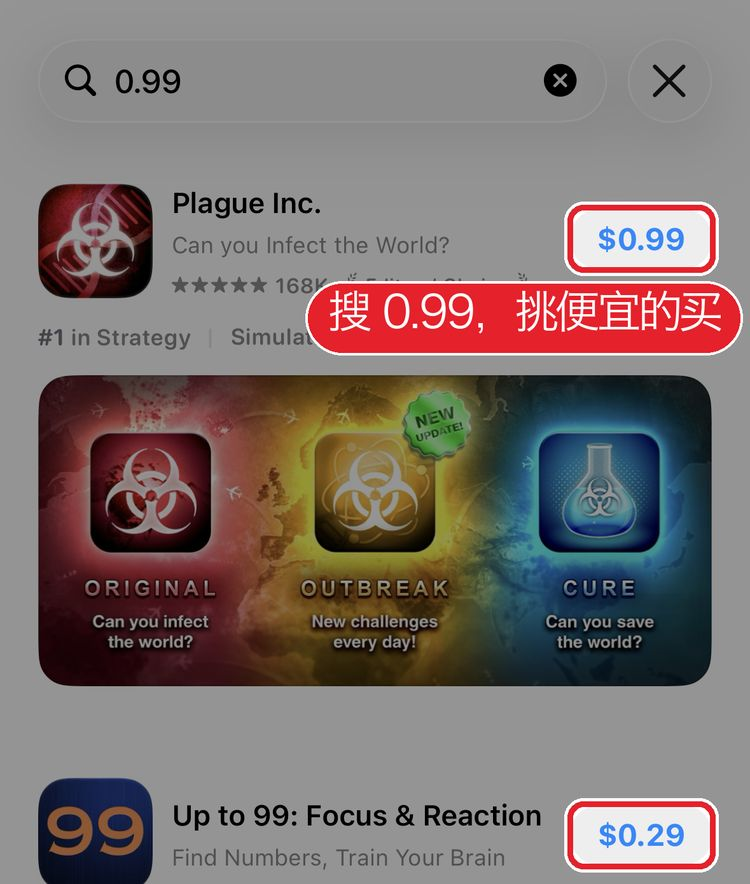
</p>

**订阅成功了？** 这条路线下个月续费前还要再充一次礼品卡。点一下右上角的 Star，下次好找回来；价格和入口有变化，也会更新在这里。

**想用礼品卡在 iPhone 上订 Pro？** 美区 App Store 的 ChatGPT 页面（10 月 22 日）列有 Pro 100 $100、Pro 200 $200。按 [OpenAI 的说明](https://help.openai.com/en/articles/7905739-chatgpt-ios-app-upgrading-to-a-paid-subscription)，Free 直接升 Pro 要去网页端，所以在 iPhone 上只能先订 Plus，再升级 Pro。要注意，一次花 $100 以上，更容易被 Apple 拦下审核，弹出「购买未完成，提交申请至 Apple 支持以供审核」，刚注册或刚改到美区的 Apple ID 尤其容易遇到。新注册的账号先买一两个便宜 App（见[上文](#apple-new-account)），再正常订几个月 Plus，有了购买记录再充大额余额；被拦了按[「购买未完成」怎么办](https://github.com/Avarce/apple-purchase-not-completed)处理。

**付款时弹出「购买未完成，提交申请至 Apple 支持以供审核」？** 这是 Apple 的购买审核，先别反复点。处理步骤和找到 Apple 在线客服的入口见[「购买未完成」怎么办](https://github.com/Avarce/apple-purchase-not-completed)。

<a id="apple-payment-info-required"></a>

**付款时提示「必须提供付款信息才能继续购买」，点「继续」又跳到添加付款方式？** 礼品卡余额不够付这一笔，多半是账单地址不在 Oregon，$19.99 被加了销售税。不用绑卡，把账单地址改成 Oregon 就能用余额付。

2026 年 10 月 22 日有读者在 [Issue #1](https://github.com/Avarce/chatgpt-plus-china-guide/issues/1) 反馈：$20 礼品卡已经充进美区 Apple ID，在 ChatGPT App 里升级时提示「必须提供付款信息才能继续购买。请登录你的 Apple 账户，然后点『账单信息』，以提供付款信息」，点「继续」后进了「添加付款方式」，还是要绑卡。把账单地址改成 Oregon，城市、邮编和电话一起换成 Oregon 的之后，用 $20 余额付成功了。

为什么会这样：

- Apple 按账单地址加收销售税（见上文[免税州设置](#apple-billing-oregon)）。$20 付完 $19.99 只剩 $0.01，加了税，余额就不够了。
- 余额不够付全额时，Apple 会从你的主要付款方式扣费（[Apple 的 App、内容和订阅如何扣费](https://support.apple.com/zh-cn/118244)）。付款方式选的是 None，没有可扣的，就提示你先提供付款信息。

怎么处理：

1. 先看余额在不在这个 Apple ID 上：App Store → 右上角头像，有余额的话，金额显示在名字下面（[查看 Apple 账户余额](https://support.apple.com/zh-cn/119902)）。没有显示，说明礼品卡兑换到了别的 Apple ID。
2. 改账单地址：在 [account.apple.com](https://account.apple.com) 打开「付款与配送（Payment & Shipping）」，Payment Type 仍选 None，State 选 **Oregon（OR）**，City 和 ZIP 填 Oregon 的城市和它对应的邮编，电话也用 Oregon 的。用 iPhone 改，Apple 给的路径是：设置 → 你的姓名 → 付款与配送 → 编辑（[更改 Apple 账户付款方式](https://support.apple.com/zh-cn/118293)）。
3. 回 iOS 版 ChatGPT App 重新点 Upgrade，付款前确认总额是 $19.99。
4. 不想改地址的话，再兑换一张礼品卡，让余额够付含税的总额。
5. 余额够、地址也改了还是弹：Apple 写过，有些购买即使用余额付，也可能要求账户里登记一张信用卡（[Apple 礼品卡和余额能买什么](https://support.apple.com/zh-cn/118245)）。这种情况见[「购买未完成」怎么办的常见问题](https://github.com/Avarce/apple-purchase-not-completed#常见问题)。

**chatgpt.com 网页端的 Apple Pay 也让绑卡？** 正常。Apple 列出的余额用途是 App Store 里的 App、App 内购买和订阅，以及 apple.com 上的产品等（[Apple 礼品卡和余额能买什么](https://support.apple.com/zh-cn/118245)），不包括其他网站。网页结账里的 Apple Pay 用的是钱包里的银行卡，礼品卡余额只能在 iOS 版 ChatGPT App 里付。

**付款后仍显示 Free？** 先核对 ChatGPT 登录账号和登录方式，再到 App 内的 Settings → Restore purchases 恢复购买；这是 [OpenAI 官方的排查步骤](https://help.openai.com/en/articles/6950777-what-is-chatgpt-plus)。

如果卡在付款或会员到账，可按具体提示查看 [ChatGPT 付款失败与订阅状态排查](https://aonir.com/guides/chatgpt-payment-failed/?utm_source=github&utm_medium=referral&utm_campaign=plus_guide&utm_content=ios_troubleshooting)，先定位问题再操作。

### 路线 D：第三方代充（多数人最省心，但要会挑）

**适合谁：** 怕折腾、不想搞虚拟卡、也没有苹果设备或不想切区、就想用人民币几分钟搞定的人。

**核心原理：** 你用人民币付给代充平台，平台用它自己的海外支付通道 + 干净网络环境，帮你在 OpenAI 官方完成 Plus 订阅。靠谱的平台是自助的——你全程不用交出 ChatGPT 账号密码，拿到的是绑在你自己账号上的官方 Plus。

**为什么这两年最流行：** 操作简单（付一下钱）、几分钟到账、全平台通用、走官方支付通道，单纯因为「代付这个动作」被封的概率很低。

但这条路的核心风险在「平台本身」，所以选平台比什么都重要，下面单独讲[怎么挑平台](#怎么挑一个不会跑路的代充平台5-条硬指标)。先把优缺点说清楚：

**优点：** 人民币直接付，不用碰虚拟卡和节点；靠谱平台几分钟到账；开通后全平台通用。

**缺点 / 注意：**

- 依赖第三方——必须找运营稳定、有真实售后承诺的平台，别图便宜碰野鸡小作坊。
- 价格随汇率有微调，但比自己折腾虚拟卡 + 海外卡门槛，整体更现实。
- **隐私红线：** 靠谱的自助平台绝不需要你的 ChatGPT 账号密码。任何让你交账号密码的个人代充、小代充，一律别碰。

### ⚠️ 单独拎出来说：共享号 / 合租，不是一条正经的路

几十块买一个多人共用的 Plus 账号，听着便宜，但代价极大，我们明确不推荐：

- 零隐私——你和陌生人共用一个号，你聊的所有内容对方都看得到，贴文档、贴代码 = 裸奔。
- 多人异地登录是 OpenAI 封号的头号触发器，账号随时挂。
- 一人违规，全员遭殃；卖家改密码跑路、店铺一夜消失都很常见，没有任何售后。

## 一张表看懂几种方式

| 方式 | 操作难度 | 到账速度 | 隐私 | 稳定性 | 真实成本 | 综合 |
| --- | --- | --- | --- | --- | --- | --- |
| A 官方直付 | 低（前提是有海外卡） | 即时 | 高，绑自己账号 | 高，官方自动续费 | $20/月原价 | 有海外卡首选 |
| B 海外虚拟卡 | 高：多为 USDT + KYC | 不稳定，失败要反复排查 | 中，身份信息给发卡平台 | 中，平台停运/跑路风险 | $20 + 各种费用 | 技术党可玩，普通人不推荐 |
| C 美区礼品卡 | 中：准备美区 Apple ID + 买卡 | 顺利时较快 | 中，走苹果内购 | 中高，苹果体系内很稳 | 2026-10 复测 ¥134.44，7 月实付 ¥135.98（Oregon 账单州，$19.99 无额外税）；Pockyt 缺货时 SEAGM 11-06 实付 ¥138.13 | 有苹果设备可选 |
| D 第三方代充 | 低：人民币付款 | 快，靠谱平台几分钟 | 高（前提：自助、不要密码） | 高（前提：平台靠谱） | 随平台/汇率 | 多数非技术用户最现实 |
| 共享号 | 低 | 快但随时失效 | 低，聊天记录暴露 | 低，随时封号 | 最便宜 | 不推荐 |

## 一个关键概念：掉订阅 ≠ 封号

这两件事经常被混为一谈，搞清楚能省你一堆焦虑：

- **掉订阅：** ChatGPT Plus 权益消失，账号本身不受影响，重新开一次就好。这跟「封号」是两回事。
- **封号（account deactivated）：** 账号被停用，聊天记录、自定义 GPT、记忆数据全部清零，申诉成功率很低。

真正导致封号的，几乎都是下面这几件事，而不是「代付」本身：

- 用了黑卡（盗刷信用卡）——个人小代充为了压价常干这个。
- 多人合租 / 共享账号——多地登录触发风控。
- 违规使用内容——踩了 OpenAI 使用政策的红线。
- 把账号密码交给不靠谱的人工代充。

只要你走正规渠道、绑自己账号、别贪便宜，封号概率其实很低，最坏情况通常是掉订阅。

## 怎么挑一个不会跑路的代充平台（5 条硬指标）

这一节不管你用不用我们的服务都值得看——它能帮你筛掉一大半草台班子：

- 看运营年限和真实口碑。优先选成立时间长、社区里有真实评价的。今天开明天关的店，出问题找不到人。
- 看支付方式。支持微信 / 支付宝这类可追溯渠道的优先；只收 USDT、或让你付到个人收款码的，格外小心——出了事你连凭据都没有。
- 看是不是自助、要不要密码。自助下单、全程不要你 ChatGPT 密码才是及格线。凡是要求你提供 ChatGPT 密码的，直接排除。
- 看有没有可查的订单体系。有订单号、能查进度的，出问题时才有据可依。
- 看售后条款写没写死。把「什么情况退、什么情况补、什么情况不管」白纸黑字写清楚的，才算专业——比一句空泛的「包售后」实在得多。

一句话：正规平台帮你扫清的只是「支付」这一环；把「支付」交出去可以，但别把「账号」也交出去。

## 我们的服务：AONIR

[AONIR](https://aonir.com/?utm_source=github&utm_medium=referral&utm_campaign=plus_guide&utm_content=brand_home) 是本文维护方，提供充值到本人账号的独立第三方会员服务。**ChatGPT Plus、Pro 100 与 Pro 200 均支持微信支付、自助下单**，不需要先联系客服询价。

<a id="aonir-plus-pro"></a>

### ChatGPT Plus、Pro 100 与 Pro 200：价格与选择

以下为 **2026 年 10 月 20 日核对的 AONIR 人民币服务价格**，均为一次性月度充值：

| 套餐 | AONIR 价格 | 适合谁 | 充值入口 |
| --- | --- | --- | --- |
| ChatGPT Plus | **¥168 / 月** | 日常写作、学习、办公与个人编程，当前用量基本够用 | [查看 Plus 套餐与账号要求](https://aonir.com/chatgpt-plus/?utm_source=github&utm_medium=referral&utm_campaign=plus_guide&utm_content=service_section) |
| **ChatGPT Pro 100**（约 10 倍） | **¥730 / 月** | 经常使用 Work / Codex 做研究、处理文件或编程，Plus 用量限制已影响工作 | [查看 Pro 100 并自助充值](https://aonir.com/chatgpt-pro/?utm_source=github&utm_medium=referral&utm_campaign=plus_guide&utm_content=service_pro_5x) |
| **ChatGPT Pro 200**（约 20 倍） | **¥1400 / 月** | Pro 100 也经常用完，持续高强度使用 Work / Codex | [查看 Pro 200 并自助充值](https://aonir.com/chatgpt-pro-200/?utm_source=github&utm_medium=referral&utm_campaign=plus_guide&utm_content=service_pro_10x) |

**怎么选：** 日常使用可以先选 Plus；若经常因用量耗尽中断工作，再考虑 Pro 100（Work / Codex 用量约为 Plus 的 10 倍，10 月 29 日起翻倍）；还不够用，再看 Pro 200（约为 20 倍）。Work 与 Codex 共用套餐用量；按 [OpenAI 当前计划与用量说明](https://learn.chatgpt.com/docs/pricing)，Pro 没有五小时限制，只算每周额度。具体消耗受模型、任务复杂度和运行方式影响，余量与重置时间以账号显示为准；API 另行计费。

**三档的下单流程相同：**

1. 打开对应产品页，确认账号要求与当前库存。
2. 填写用于订单查询和售后的联系方式，通过微信完成付款。
3. 按订单页指引提交本次充值所需信息，无需提供 ChatGPT 登录密码；完成后在自己的 ChatGPT 账号中核对套餐与有效期。

- **本人账号使用：** 不提供共享账号。会员权益生效在你自己的 ChatGPT 账号，可在该账号支持的网页、桌面及移动端使用。
- **续费说明：** 一次购买生效一个月，不绑定自动扣费。会员时长不会叠加。如需在到期前充值，建议临近到期再操作。
- **售后说明：** Plus、Pro 100、Pro 200 均提供 30 天掉订阅质保。账号仍可正常登录但订阅权益提前失效，经核实符合条款后，按剩余有效期折算退款；账号封禁或平台限制不属于掉订阅保障。具体以产品页和服务条款为准。

已有 Go / Plus / Pro 未到期也能覆盖充值，会员时长不叠加，建议临近到期再操作。另有 Pro 500（¥3500 / 月），由客服确认账号后开通。价格与库存以下单页为准。

## 充完之后：账号是你自己的，记住这几条

代充只解决了「支付」这一环。会员到手后，账号能不能长期稳定，取决于你怎么用：

- 网络环境别太乱。用相对固定、干净的节点就行，别用免费的「万人骑」IP，也别一天到晚在不同国家之间来回切——频繁跨国跳转是 OpenAI 最容易盯上的异常行为之一。
- 账号只握在自己手里。优先走自助渠道，别到处交账号密码；万一遇到必须人工操作的场景，事后第一时间改密码、检查登录设备。
- 开通后花十秒确认真到账了。进 Settings → 看到订阅状态是 Plus、模型列表里能选到新模型，就算成了；一时没显示，先完全退出重新登录或换无痕，再对一下你充的是哪个邮箱（多账号的人很容易付错号）。

## 常见问题 FAQ

### Q：微信 / 支付宝能直接付给 OpenAI 吗？

不能。OpenAI 官方收的是国际信用卡、Apple / Google 的应用内购买，以及在美国销售的 OpenAI 礼品卡（官方规定人在美国、用美元计费的账号兑换，详见 [OpenAI Gift Card 指南](https://github.com/Avarce/openai-gift-card-guide)）。所有「微信直充 ChatGPT」本质上都是第三方在中间转了一道。

### Q：用国内信用卡到底能不能成功？

按 OpenAI 的规定，付款卡要由支持地区的银行发行，中国大陆、香港、澳门不在名单里，所以国内银行发的卡（包括双币卡、全币卡）不在官方支持范围内。别反复试。原因和出处见[上文](#先搞明白为什么国内充-plus-这么难)。

### Q：Pockyt Shop 缺货了，美区礼品卡还能在哪里买？

Pockyt 11 月 6 日中午已补货，库存变化见 [Pockyt Shop 现在还能买吗](#pockyt-status)。再缺货的话可以用 SEAGM：11 月 6 日我们实测，网页注册账号，支付宝付款，$20 苹果美区礼品卡（Apple 礼品卡(美国)）实付 ¥138.13，约 3 分钟拿到兑换码，兑换成功。完整步骤、截图和注意事项见[上文](#seagm)；开着代理可能打不开，关掉代理（节点）直接打开就行。其他渠道我们没实测，不做推荐；淘宝、闲鱼的低价卡密不建议买。

### Q：通过代充开 Plus 会被封号吗？

AONIR 目前未遇到因充值导致的封号情况，使用的是 Apple 订阅渠道，Plus 会开通到用户本人的 ChatGPT 账号。但账号封禁、限制或验证要求最终由 OpenAI 根据平台规则处理，任何第三方都不能保证账号绝对不会被限制。请不要共享、出租或转售账号，并遵守平台使用政策。

### Q：代充要我账号密码，安全吗？

正规的自助平台不需要你的密码。凡是张口就要账号密码的个人代充，一律别用。

### Q：想省钱，淘宝/闲鱼上几十块的个人代充或共享号能不能碰？

不太建议。价格明显低于市场价的，来源很难查清楚，开通以后容易出问题，比如被 Apple 发现付款来源不正常；共享号是好几个人用同一个账号，聊天记录彼此都看得到。这类小店变动也快，出了问题不一定找得到人。预算有限的话，可以先看看[几种方式的成本对比](#一张表看懂几种方式)再决定。

### Q：Plus 和 Pro 怎么选？

先看一周内是否经常触及用量上限。日常写作、学习和编程可以先选 Plus；如果 Work / Codex 经常因用量耗尽中断，再考虑 Pro 100。AONIR 当前 **Plus ¥168 / 月、Pro 100 ¥730 / 月、Pro 200 ¥1400 / 月**，三档均支持微信自助充值，入口见 [上方套餐表](#aonir-plus-pro)。更详细的权益差异见 [ChatGPT Free、Plus 与 Pro 怎么选：Pro 100、200、500 的区别](https://aonir.com/guides/chatgpt-free-plus-pro/?utm_source=github&utm_medium=referral&utm_campaign=plus_guide&utm_content=plans_faq)。

### Q：充值失败了怎么办？

先别慌，多半是官网当时拥堵或网络节点不稳。拿订单号找平台客服重试就行；正规平台会换通道或换 IP 帮你重试，实在交付不了的会按条款退款。

### Q：到期了怎么处理？

看你在哪开的：官网订的在 ChatGPT Settings 里管理，iOS 订的在 Apple ID 订阅里管理。AONIR 为单次月度充值，不绑定自动扣费，充值前请按产品页确认当前账号状态。会员时长不会叠加。如需在到期前充值，建议临近到期再操作。

## 附录：卡在哪一步，就看哪一段（自助排查）

国内自己开 Plus，几乎所有人都会卡在下面三个阶段之一。先判断你卡在第几步，再对号入座，比盲目重试有用得多——而且重试越多，越容易给账号累加风控分。

### 阶段一：还没到支付页，就打不开 / 转圈

- **点了「Upgrade」没反应、Stripe 弹窗一直加载：** 多半是节点带宽小、丢包高，Stripe 的脚本没加载全，或浏览器缓存了上次的失败状态。换一个稳定的美区节点、开无痕、清一下缓存重试。
- **提示 Country not supported：** 你的网络出口落在了不支持的地区。把出口切到美 / 英 / 新 / 日 / 加等支持地区，并且别频繁在不同国家之间跳。
- **判断要点：** 这一阶段的问题基本都是网络问题，跟你的卡没关系，别急着换卡。

### 阶段二：进了支付页，但付不进去

- **「您的银行卡被拒绝了」（Your card has been declined.）或「付款未获批」（Payment was not approved）：** 结账页不说原因。先看发卡银行在不在 OpenAI 支持的地区，中国大陆、香港、澳门不在（见[上文](#先搞明白为什么国内充-plus-这么难)），国内银行发的卡换支付方式（礼品卡 / 代充）才是正路。是支持地区的卡，再按 OpenAI 的顺序查：卡号、有效期、安全码和账单地址，银行有没有拦截境外交易，3D 验证有没有完成。7 种提示的原文对照见 [ChatGPT 付款未获批准怎么办](https://aonir.com/guides/chatgpt-payment-not-approved/?utm_source=github&utm_medium=referral&utm_campaign=plus_guide&utm_content=appendix_declined)。
- **提示需要验证，或 3D Secure 验证失败：** OpenAI 给的办法是允许弹窗和页面跳转、关掉广告拦截插件，用隐私模式或换浏览器、设备、网络再试；在银行短信或 App 里确认时，不要关闭或刷新结账页。还不行，请发卡银行为网上、境外交易开通 3D 验证，或者换一张卡（[Why was my credit card declined?](https://help.openai.com/en/articles/7232916-why-was-my-credit-card-declined)）。
- **Something went wrong, please try again later：** 常见于同一 IP 短时间内多次尝试、或卡段已被标记。别硬刚，换个思路（礼品卡 / 靠谱代充）比在这里死磕划算。
- **iOS 内购提示「必须提供付款信息才能继续购买」：** 用礼品卡余额付时最常见的原因是账单地址不在 Oregon，$19.99 加税后超过 $20 余额。不用绑卡，改账单地址就行，步骤见[路线 C 里这一段](#apple-payment-info-required)。

### 阶段三：付款过了，但会员没到 / 账号异常

- **扣款成功却没有 Plus 标识：** 先完全退出重新登录或换无痕；再确认你充的是哪个邮箱（多账号很容易付错号）；还没有就去邮箱搜 OpenAI 的收据邮件，确认到底扣款没有。
- **礼品卡兑换提示 This code has already been redeemed：** 这张卡已经被兑换过。来源不明的低价卡密容易遇到这种情况；从有公司主体、能查订单的渠道买（本文实测的 Pockyt、SEAGM），风险小得多。买到这种卡，先联系卖家。
- **Your account has been deactivated：** 分两种——充值前就被封的，多是网络/滥用/违规内容触发，可发邮件申诉但成功率不高；充值后被封的，大概率跟黑卡、人工代充交号、或多人共享有关。这也是本文反复强调「别贪便宜」的原因。

## 一句话总结

国内自己开 ChatGPT Plus，难点主要在两处：付款方式和网络环境。国内银行发的卡不在 OpenAI 支持范围内，反复尝试一般也过不了。比较现实的做法：有海外卡的走官方，有苹果设备的走美区礼品卡，其他朋友可以找一个靠谱的自助平台，把付款这一步交出去。

不管选哪条路，都需要一个稳定、能正常访问 ChatGPT 官网的网络环境。

**免责声明：** 本文仅供信息参考。OpenAI 政策与各平台价格可能随时变化，请以官网 / 下单页最新信息为准。请遵守相关法律法规及各平台使用条款，所有操作与后果由用户自行承担。
